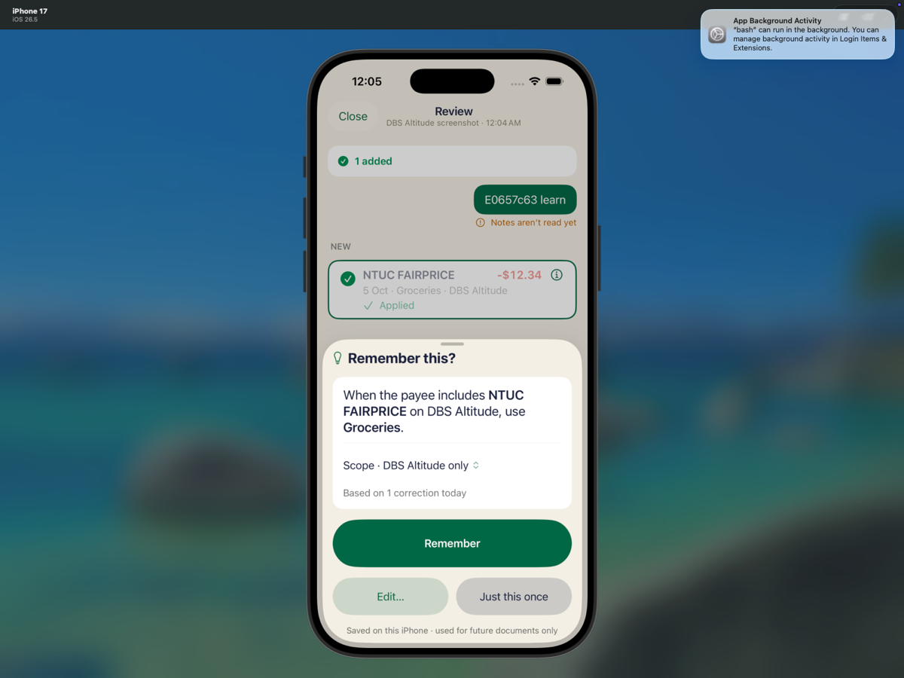
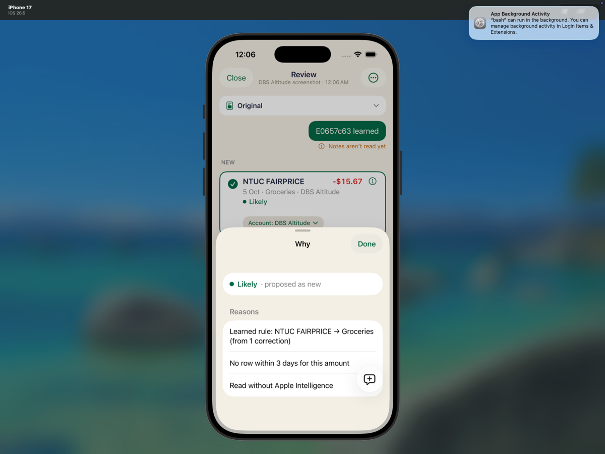
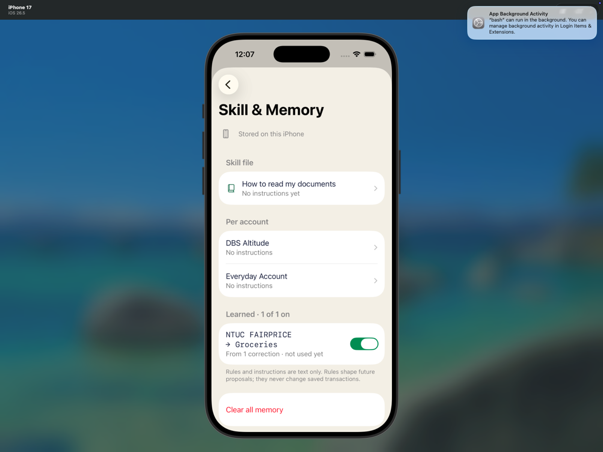
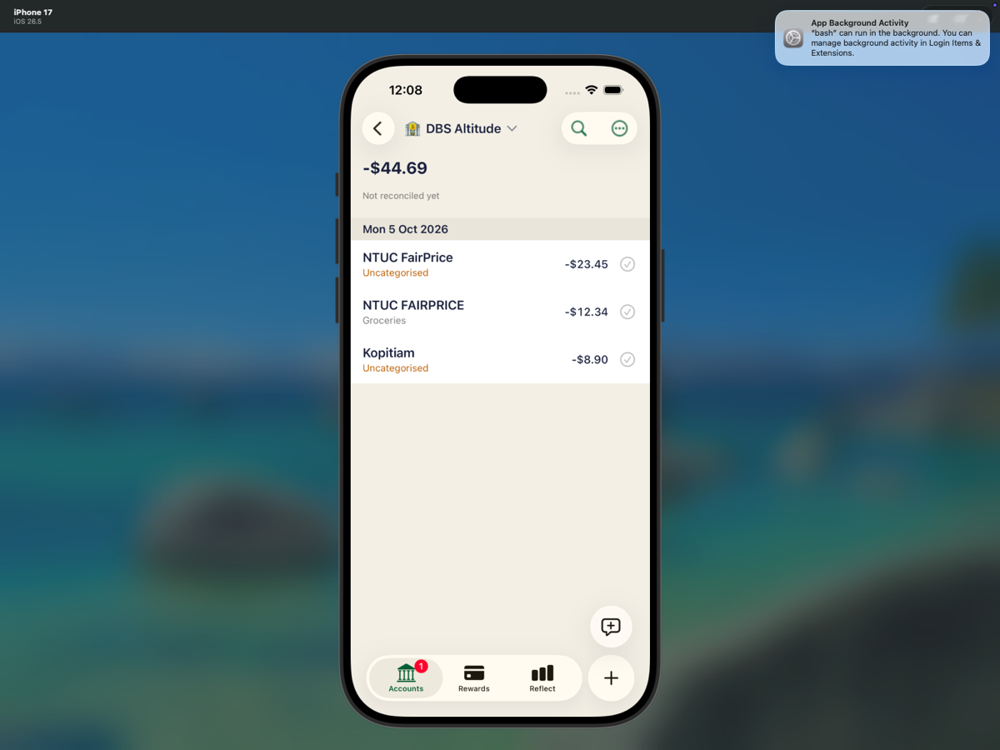

# E Skill & Memory UI — 0657c63

Exact detached revision: `0657c6310aeb80d351824a69817ee356e3f18579`.
Executed 7 Oct 2026 on existing iPhone 17 / iOS 26.5 Simulator `EDD9B083-63F1-44E6-9A7B-0A6964CC2561`, Xcode `/Applications/Xcode-27.0-RC.app`.

Completed real Photos sharing, draft editing, approval, explicit Remember, learned-rule explanation, saved-row guard, deletion and relaunch. Core requested behavior passed. **One adjacent defect observed:** deleting the learned rule also removes `Read without Apple Intelligence` from the pending NEW row's Why. No fixes made.

Separate exact-revision wrapper run on `0657c6310aeb80d351824a69817ee356e3f18579`: 823 passed, 0 failed, 2 skipped; build-for-testing and test execution succeeded; wrapper exit 0; command wall time 950.49 seconds. Xcode logged a 600-second Simulator diagnostics-collection timeout; test execution still succeeded.

## Scope and setup

- Installed the supplied `build/xcode/DerivedData-simulator/Build/Products/Debug-iphonesimulator/HowMuch.app`; no build or shell-suite rerun.
- Existing local synthetic plan only; no server login, production access, secrets, DB writes, proposal injection, rule injection, direct approval, reset or teardown.
- Preserved pre-E Jobs/Inbox archive and shell evidence already supplied in this folder. The UI procedure made no checkout, source/test edit, commit or push; this evidence-only commit is separate from that procedure, lands on the fetched branch head, and does not validate newer code.
- Baseline: 2 live rows (Kopitiam -8.90 and C NTUC FairPrice -23.45), plus B's soft-deleted NTUC tombstone. DBS balance -32.35. C NTUC category null. Groceries already present. Skill file absent.
- First extension opening showed `Open Halation to finish setting up`; canceled without sending. Normal host launch refreshed local share context, confirmed `isSignedIn=true`, DBS last-used and 0 Jobs/Inbox in `02-ready-baseline.json`. A rapid navigation mistake opened Calendar; its unrelated permission prompt was denied. No test data changed.
- PNGs generated by artifact-only `make-fixtures.swift`, imported to Photos via `simctl addmedia`.
- `E-learn.png`: `05 OCT NTUC FAIRPRICE -12.34`.
- `E-learned.png`: `05 OCT NTUC FAIRPRICE -15.67` and `05 OCT NTUC FAIRPRICE -23.45`.

Reproduction setup commands (from repository root, use existing isolated local state rather than blindly recreating it):

```sh
export DEVELOPER_DIR=/Applications/Xcode-27.0-RC.app/Contents/Developer
xcrun simctl install EDD9B083-63F1-44E6-9A7B-0A6964CC2561 build/xcode/DerivedData-simulator/Build/Products/Debug-iphonesimulator/HowMuch.app
xcrun simctl launch EDD9B083-63F1-44E6-9A7B-0A6964CC2561 sg.soon.howmuch
swift .amp/in/artifacts/share-intake/0657c63/make-fixtures.swift .amp/in/artifacts/share-intake/0657c63
xcrun simctl addmedia EDD9B083-63F1-44E6-9A7B-0A6964CC2561 .amp/in/artifacts/share-intake/0657c63/E-learn.png .amp/in/artifacts/share-intake/0657c63/E-learned.png
python3 .amp/in/artifacts/share-intake/0657c63/snapshot.py CHECKPOINT
```

`snapshot.py` dynamically discovers app/group containers, opens SQLite `mode=ro`, reads authorized transaction/account/category queries and copies job/skill JSON. Its exact SQLite queries are:

```sql
SELECT id, name, closed, balance_milli FROM accounts
SELECT id, account_id, date, amount_milli, payee_name_snapshot, approved FROM transactions
SELECT id, deleted FROM transactions
SELECT id, account_id, date, amount_milli, payee_name_snapshot, approved FROM transactions WHERE deleted = 0
SELECT id, account_id, date, amount_milli, payee_name_snapshot, category_id, category_name_snapshot, approved, deleted FROM transactions
SELECT id, name, category_group_id, hidden, internal, deleted FROM categories
SELECT name FROM sqlite_master WHERE type='table'
```

No alternate schema or mutation was needed.

## Exact UI steps and observed results

| Step / expected | Observed | Result / evidence |
|---|---|---|
| Photos first PNG → Share → Halation; DBS/Auto; note `E0657c63 learn`; Send | One NEW NTUC -12.34, 5 Oct, DBS, No category | Passed; 03/04 screenshots and 04 snapshot |
| NEW row → Category → Groceries → Done; nothing saved | Review draft shows Groceries. Accounts, historical/live transactions and deletion flags identical to baseline before and after Done | Passed; 06/07 snapshots |
| Approve all 1 saves only -12.34 Groceries | Exactly one new approved live row; old rows unchanged, 3 live / 4 historical, DBS -44.69 | Passed; 08 snapshot, 09 register |
| Explicit Remember prompt, keep DBS scope | `Remember this?` / `For NTUC FAIRPRICE in DBS Altitude, use Groceries.` / `Remember` / `Edit…` / `Just this once` / `Saved on this iPhone · used for future documents only` | Passed; 08 screenshot |
| Tap Remember creates rule, not before | Before Remember skill has `rules:[]` and offered job. After Remember one enabled account-scoped rule, 1 correction, hits=0 | Passed; 08/09 snapshots |
| Photos second PNG → Share → DBS/Auto; note `E0657c63 learned`; Send | NEW -15.67 pre-categorized Groceries; ALREADY IN -23.45, Matches 5 Oct in DBS Altitude | Passed; 11/12 screenshots |
| NEW Why explains learned rule | `Learned rule: NTUC FAIRPRICE → Groceries (from 1 correction)`; `No row within 3 days for this amount`; `Read without Apple Intelligence` | Passed; 13 screenshot/snapshot |
| Same-payee saved row protected | Exact C target ID; category remains absent/null, no rule application; persisted reason `Learned rule not applied to a saved transaction` | Passed via raw job + DB; ALREADY IN intentionally has no Why control, so this exact guard text was not visible in UI |
| Follow-up not approved | Both proposals pending/isApplied=false; job proposed; ledger identical to post-first-approval | Passed; 13 snapshot |
| Settings → Intelligence → Skill & Memory | `Learned · 1 of 1 on`; `NTUC FAIRPRICE → Groceries`; `From 1 correction · not used yet`. Rule editor: Set category/Groceries, One account/DBS Altitude, enabled | Passed; 14/15 screenshots |
| Delete rule → confirm | `Delete this rule?` / `Future documents won’t use it.` / Cancel / Delete. Rule disappears | Passed; 16/17 screenshots; 17 rules=[] |
| Terminate/relaunch; rule absent, saved rows intact | `Nothing learned yet. After you approve a batch, Halation may offer to remember a correction.` Rules=[]; approved Groceries row and C uncategorized row still visible and persisted | Passed; 18/19 screenshots and 18 snapshot |
| Preserve pending follow-up | Job still proposed, both pending/unapplied; deletion re-applies proposals, so NEW category is now absent | Passed; 18 snapshot; final Inbox 1 screenshot |
| Preserve unrelated fallback provenance on reapply | NEW Why loses `Read without Apple Intelligence`; only `No row within 3 days for this amount` remains. ALREADY IN still retains fallback reason | **Failed adjacent check**; 13 versus 17/18 JSON and 20 screenshot |

Both notes display `Notes aren’t read yet`. Skill `not used yet`/hits=0 reflects the unapproved follow-up, not an absent proposal application; `ruleApplications` proves the rule applied to the proposed NEW row before deletion.

## Exact IDs and persisted state

First job: `364BAAC7-CEE7-45B1-B794-3AAA310F9BE7` — final `applied`, proposal `editedThenAccepted`, isApplied=true.

Created transaction:
```text
txn_5f0796c3-bdb2-4cda-872f-79c2b022df97
e2e-dbs | 2026-10-05 | -12340 | NTUC FAIRPRICE
category_id=starter:plan_613b3d02-e28b-4c3b-b514-afaf3deb047e:cat:groceries
category_name_snapshot=Groceries | approved=1 | deleted=0
```

Remembered then deleted rule: `E2454D3D-5A2F-4987-BB91-DB14120C66D0`.
```json
{"scope":{"kind":"account","value":"e2e-dbs"},"when":{"accountID":"e2e-dbs","payeeToken":"ntuc fairprice"},"then":{"kind":"setCategory","value":"starter:plan_613b3d02-e28b-4c3b-b514-afaf3deb047e:cat:groceries"}}
```

Follow-up job: `1C7BB734-12AD-41E3-96D6-1FCD80D8FA02` — final proposed/unapproved.
- NEW proposal `EB851D72-4D70-4B13-A3B5-C62FF7B752FB`, amountMagnitudeMilli=15670.
- ALREADY IN proposal `A07B6605-A2AB-4AB3-9A3F-C03C33114C31`, target `txn_c95b236c-7263-48ac-b9e2-1c620f718dfd`, amountMagnitudeMilli=23450. No category effect; ruleApplications=[].

Original C saved row remains `e2e-dbs | 2026-10-05 | -23450 | NTUC FairPrice | category=null | approved=1 | deleted=0`. Original `e2e-existing-kopitiam` remains -8900 uncategorized. B tombstone `txn_5a0cabc1-c688-4c42-8891-a45116d7e610` remains deleted=1. No -15.67 ledger row exists.

## Defect reproduction and source context

After a fallback-read NEW row gets a learned category, open its Why (13), then Settings → Skill & Memory → learned rule → Delete rule → Delete, relaunch and open the same pending NEW row Why (20). Expected learned category/reason gone, but unrelated fallback provenance retained. Actual: both learned and fallback reasons disappear. Ledger remains safe.

Lead-provided source context is consistent with the observation: `SkillAndMemoryView` rule-delete callback around line 229 invokes `reapplyRules`; `IntakeCoordinator.swift:1155–1163` rematches untouched add/possibleDuplicate rows via `rematchRow`, while alreadyIn calls `refreshNotAppliedNote`. `rematchRow:1123–1125` replaces reasons with match reasons; fallback provenance was appended only during `makeProposals:524–527`. This is source context, not a separately observed debugger execution trace.

## Visual evidence

| Remember prompt | Learned-rule Why before deletion |
|---|---|
|  |  |

| 🔴 Before: remembered rule | 🟢 After: absent after relaunch |
|---|---|
|  |  |

| Register after relaunch — intact | Defect — fallback Why missing after deletion |
|---|---|
|  |  |

All original PNGs are also bundled locally for offline inspection.

## Runtime and limitations

The full `runtime.log` remains local; only selected lines are included in the committed `runtime-excerpts.log`. `runtime.log` was captured via:
```sh
xcrun simctl spawn EDD9B083-63F1-44E6-9A7B-0A6964CC2561 log show --style compact --start '2026-10-07 00:00:00' --predicate 'process == "HowMuch" OR process == "Halation" OR process == "HowMuchShare"'
```
Model assets unavailable; real fallback produced both batches:
```text
Error Domain=com.apple.UnifiedAssetFramework Code=5000 "There are no underlying assets (neither atomic instance nor asset roots) for consistency token for asset set com.apple.modelcatalog"
Prewarm failed: Model Catalog error
```
The same asset error appears for `com.apple.MobileAsset.UAF.FM.Overrides`. No crash/main-thread termination or navigation warning was observed. Apple Intelligence parsing is not proven by this run; fallback behavior is.

## Artifacts and handoff

- This artifact-only publication contains the report, selected synthetic JSON snapshots/comparisons, selected PNG copies downscaled to at most 1200 px on the long edge without cropping, and `runtime-excerpts.log`.
- The full runtime log, full shell-test logs and shell-test folder, original-size PNGs, Simulator recording/video, TXT checkpoints, fixture PNGs and generator, snapshot helper, test plan, hash manifest, zip, and preserved-pre-test Jobs archive remain local and are deliberately excluded.
- `evidence-checks.json` preserves the checkpoint comparisons, including the explicit failed fallback-provenance check. The exact read-only SQL queries from the local snapshot helper are listed above.

PR-comment suggestion: none; no PR specified. SKILL.md suggestion: none.
Blueprint checked: none exists. Suggested setup knowledge: use supplied exact product/pinned Xcode and existing Simulator; launch host once after install before opening extension; discover containers dynamically; query SQLite read-only; preserve tombstones separately from live counts. No dependencies/services installed.
Needed from user: none for completed run. Lead owns any fix/retest decision; artifact-only publication adds no code fixes. Runtime remains on Accounts with Inbox 1; Simulator, app data, pending follow-up, approved row, archives and product preserved.
