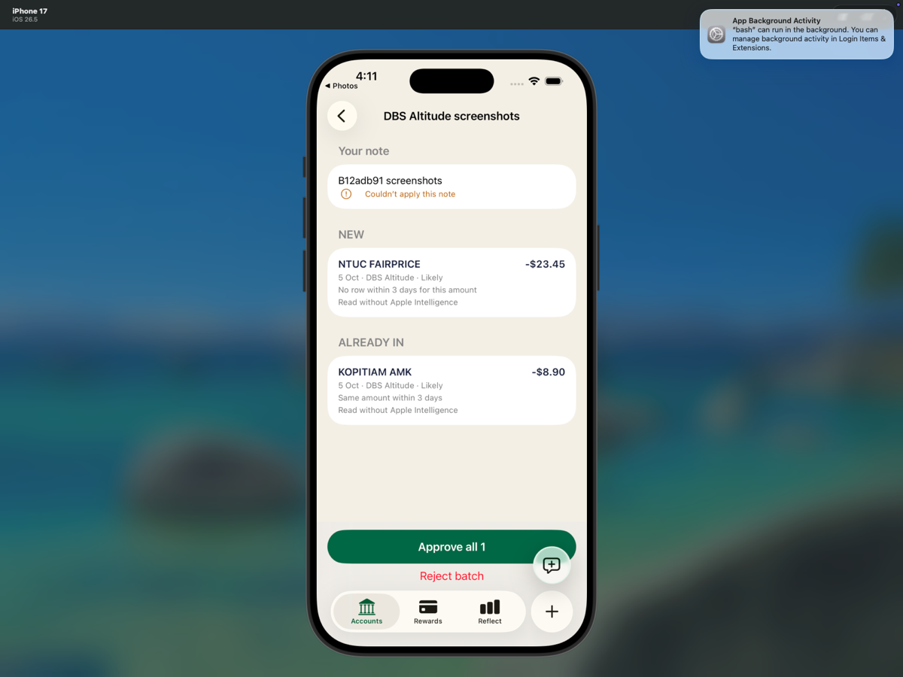
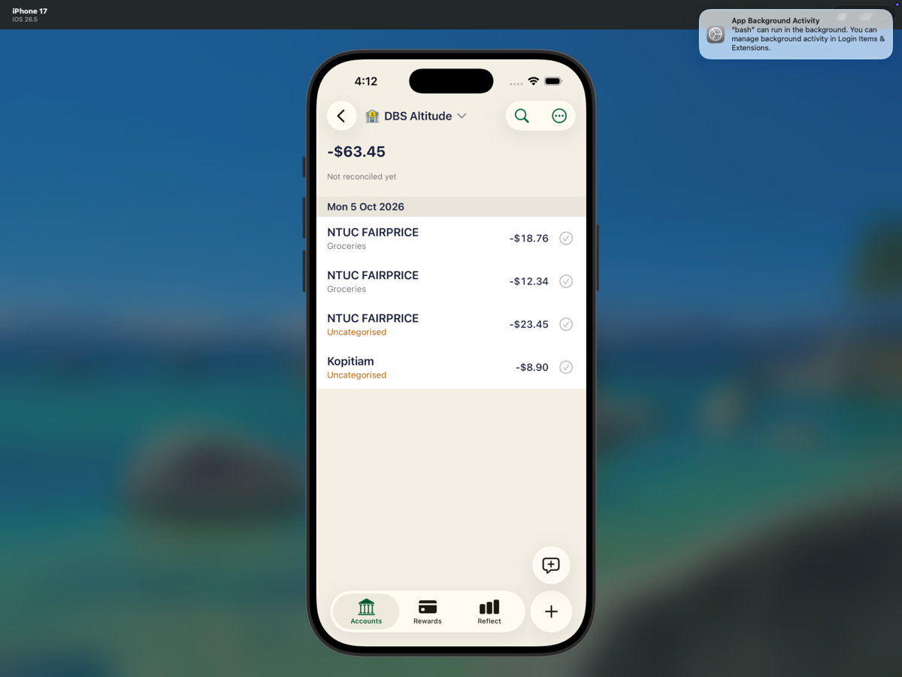

# Short screenshot-batch regression — 12adb91

Executed native iOS Simulator flow on exact **12adb917270d872474069d5e44eebaa6db4b772e**, branch context **claude/share-intake-2-jobs**. The UI flow itself made no source fixes, builds, suites, checkouts, commits or pushes. Lead owns evidence publication; the separate shell gate is summarized below.

## Caveats first

- Note `B12adb91 screenshots` was retained and visibly showed **“Couldn’t apply this note”**. Note interpretation did not succeed; this run proves screenshot classification/approval, not note semantics.
- Simulator model assets were unavailable: **Code=5000 / Prewarm failed**. Both screenshots were read using fallback; confidence was Likely (NTUC 0.8; Kopitiam 0.85). No claim of Apple Intelligence extraction.
- Source Photos launch used `simctl launch` after native Home; all photo selection/sharing, setup deletion and approval were actual UI actions. An attempted Home-page swipe did not move the page. No injected jobs/proposals or direct ledger writes.
- Setup deletion preceded the focused recording and is documented by confirmation screenshot and before/after read-only snapshots. The continuous video covers Photos share through approval and relaunch.
- Short scope only: PDF, notification, Skill & Memory and other review flows not rerun.

## Environment and preserved setup

Device **EDD9B083-63F1-44E6-9A7B-0A6964CC2561**, iPhone17/iOS26.5; other booted iOS27 device not used. Pinned `DEVELOPER_DIR=/Applications/Xcode-27.0-RC.app/Contents/Developer`.

Installed supplied `build/xcode/DerivedData-simulator/Build/Products/Debug-iphonesimulator/HowMuch.app` over existing install; no uninstall/reset. Preserved on-device synthetic session with `https://local.howmuch` fingerprint, no production/API/sign-in/secrets.

Copied prior four active Jobs and empty Inbox to `preserved-pre-test/` and captured `01-preserved-before-setup.json`. Originals stayed active throughout; comparison confirms all previous jobs unchanged.

## Separate shell gate

The fresh `scripts/ios-xcodebuild.sh test` run was completed separately on the same exact SHA using Xcode 27.0 (27A266a), ad-hoc Simulator signing, the existing booted iPhone 17, and retained DerivedData. Build-for-testing exited 0 in 11s; test execution exited 0 in 847s; wrapper exit was 0. The xcresult reports **793 passed, 0 failed, 2 skipped** (795 total). `IntakeLineParserTests`: **43 passed, 0 failed, 0 skipped**; `IntakeMatcherTests`: **26 passed, 0 failed, 0 skipped**.

Skipped tests: `CaptureInterpreterTests/testLiveFoundationModelsCoffeeAddUpdateAndTodayQuery()` and `LocalModeTests/testLocalModeScreensRender()`. `/usr/bin/time -p`: real 882.92s, user 19.31s, sys 9.04s; UTC `2026-10-07T10:51:47Z`–`2026-10-07T11:06:30Z`. Xcode's Simulator diagnostics collection timed out after 600s, but test execution succeeded. This shell gate is separate from the UI observations below.

**Authorized setup deletion, not feature write:** DBS register → NTUC FairPrice -23.45 → Delete Transaction → confirmation. Deleted only C’s `txn_c95b236c-7263-48ac-b9e2-1c620f718dfd` through UI. It remains `deleted=1`. B’s older tombstone remains too. Unrelated E -12.34 and E92 -18.76 unchanged. Baseline is three live rows, five historical, DBS -40.00.

Imported copies of the original `screenshot-1.png` and `screenshot-2.png` into Photos. These carry `05 OCT KOPITIAM AMK -8.90` and `05 OCT NTUC FAIRPRICE -23.45`; original file hashes match the job sources:

```text
8a363fd697812e191ea387dc7e4c5d16b34b6f20e83b4bef6e6e485203ea01fe
d87aeb1deb3297258452ee46687bb79f7ecaace732d67882da9e80c679fa876e
```

## Expected versus observed

| Action / expected | Observed | Result |
|---|---|---|
| Photos → newest two originals → Share → Halation; DBS/Auto/note before Send | Two thumbnails, DBS Altitude, selected Auto, exact note visible | Passed |
| Open newest two-screenshot batch | Accounts row “1 new and 1 already in” opened batch directly | Passed |
| NTUC NEW -23.45, 5 Oct/DBS | NEW NTUC FAIRPRICE; Likely; “No row within 3 days for this amount”; “Read without Apple Intelligence” | Passed |
| Kopitiam ALREADY IN -8.90, 5 Oct/DBS | ALREADY IN KOPITIAM AMK; Likely; “Same amount within 3 days”; fallback reason; exact original target ID | Passed |
| No save before Approve | Snapshot06 accounts, historical rows, live rows, category rows and deletion flags equal baseline03 | Passed |
| Approve all 1 creates one row only | Toast “1 added · Saved on device”; new job applied with `appliedSummary=1 added` | Passed |
| Exactly one live NTUC -23.45, no duplicate Kopitiam | One new approved row; original Kopitiam and all baseline historical rows unchanged | Passed |
| Register then terminate/relaunch | Four visible live rows dated Mon 5 Oct2026, DBS -63.45; snapshots08/09 ledger and jobs identical | Passed |
| Preserve prior pending jobs/tombstones | All four old job JSONs unchanged baseline→final; B+C tombstones retained | Passed |

Batch ID **40AF3AF0-42A2-4705-8E00-C2E9D319C681**, origin `shareSheet`, hint `auto`, state proposed before approval. Kopitiam proposal **01871F9F-F6AC-45F5-A4AF-376BB1E8BBD0**, target `e2e-existing-kopitiam`; NTUC proposal **F1C09B4E-6A4F-4792-9109-385F68B8F5BE**.

Exactly one feature-created transaction:

```text
txn_51258cd7-90b6-49e0-9d20-d2558c5f91ee
e2e-dbs | 2026-10-05 | -23450 | NTUC FAIRPRICE
category_id=null | approved=1 | deleted=0
```

Final: **4 live / 6 historical**, including **2 deleted prior NTUC tombstones**. Exactly one historical/live Kopitiam, `e2e-existing-kopitiam`, -8900. Other live amounts -12340 and -18760 unchanged. DBS balance -63450; Everyday and Closed balances 0.

## Visual evidence

| Before approval | After relaunch |
|---|---|
|  |  |

## Reproduction and evidence

Use preserved synthetic local setup, never production. The locally retained `snapshot.py` helper opens dynamically discovered SQLite with `mode=ro`; no SQL schema mismatch occurred. The read-only SQL statements below are copied verbatim from that helper:

```sql
SELECT id, name, closed, balance_milli FROM accounts
SELECT id, account_id, date, amount_milli, payee_name_snapshot, approved FROM transactions
SELECT id, deleted FROM transactions
SELECT id, account_id, date, amount_milli, payee_name_snapshot, approved FROM transactions WHERE deleted = 0
SELECT id, account_id, date, amount_milli, payee_name_snapshot, category_id, category_name_snapshot, approved, deleted FROM transactions
SELECT id, name, category_group_id, hidden, internal, deleted FROM categories
SELECT name FROM sqlite_master WHERE type='table'
```

The helper scripts are retained locally and excluded from the published file set.

```sh
# In repo root, after corresponding UI checkpoint:
python3 .amp/in/artifacts/share-intake/12adb91/snapshot.py LABEL
# Compare saved evidence only, no app/database access:
python3 .amp/in/artifacts/share-intake/12adb91/evidence-checks.py
```

Checkpoints: `01-preserved-before-setup`, `03-baseline`, `06-before-approve`, `08-after-approve`, `09-after-relaunch` (each JSON plus TXT). `evidence-checks.json` contains 13 passing read-only comparisons.

`runtime-through-relaunch.log` is a stable capture of the ongoing `runtime.log`; command predicate is `process == "HowMuch" OR process == "HowMuchShare"`, level debug. `runtime-excerpts.txt` contains exact line-numbered errors/counts. **8 Code=5000 matches, 2 Prewarm failed; zero NSInternalInconsistencyException, Terminating app, Assertion failure, IntakeRoute, navigationDestination or NavigationLink matches.**

Representative exact error:

```text
Error Domain=com.apple.UnifiedAssetFramework Code=5000 "There are no underlying assets (neither atomic instance nor asset roots) for consistency token for asset set com.apple.modelcatalog"
```

Also occurred for `com.apple.MobileAsset.UAF.FM.Overrides`. These environment errors do not invalidate the observed fallback classification/persistence.

## Publication / handoff

The committed artifact set contains only `report.md`, ten selected PNGs, six synthetic JSON files (the five read-only checkpoints and `evidence-checks.json`), and `runtime-excerpts.txt`.

The five numbered TXT snapshot companions, `test-plan.md`, `CURATED-MANIFEST.txt`, `SHA256SUMS.txt`, `snapshot.py`, `evidence-checks.py`, annotated MP4, curated ZIP, raw runtime logs, preserved Jobs/Inbox copies, and shell outputs remain local and are not committed. No database was copied. The Simulator remains on the final DBS register; product, data, old and new jobs, and logs remain preserved.
