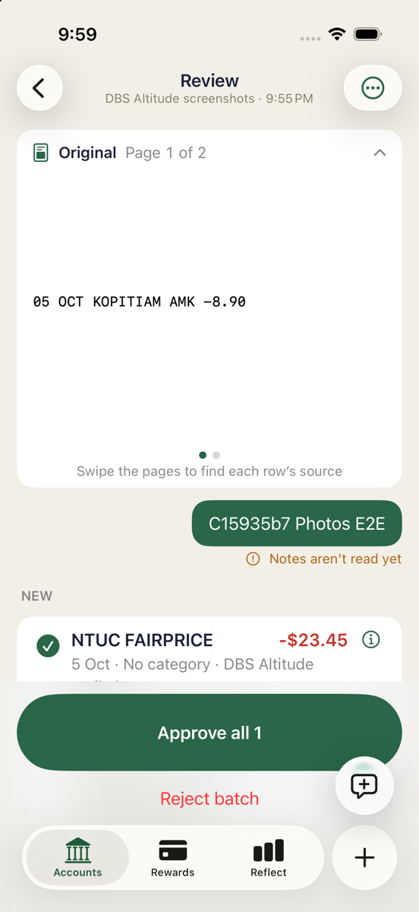
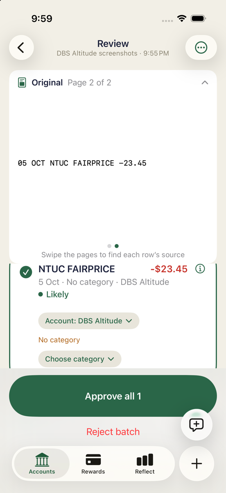
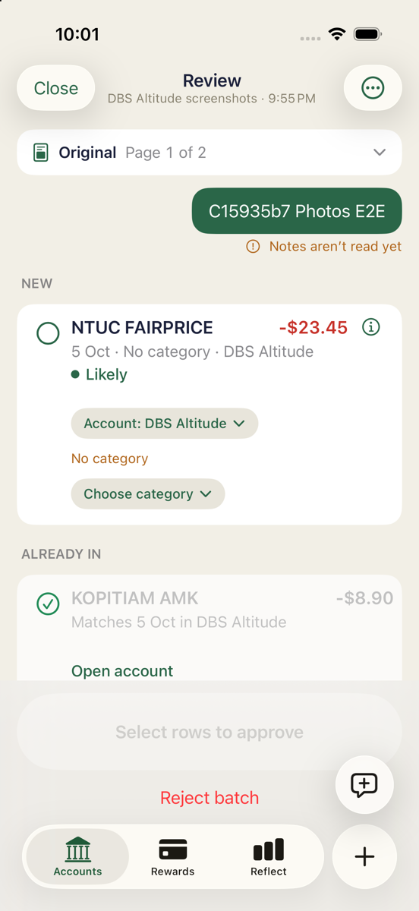
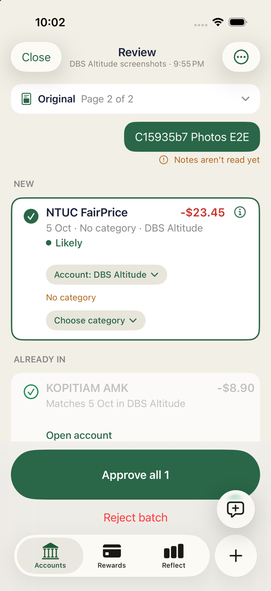
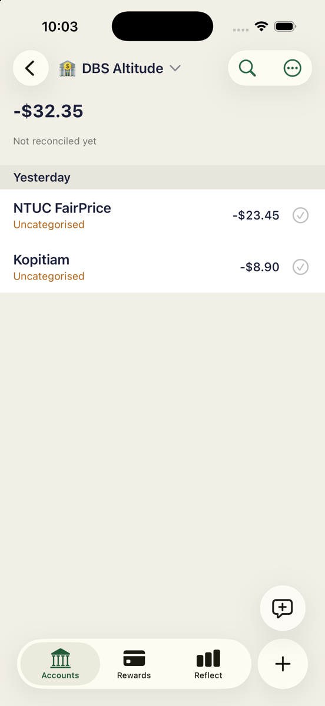
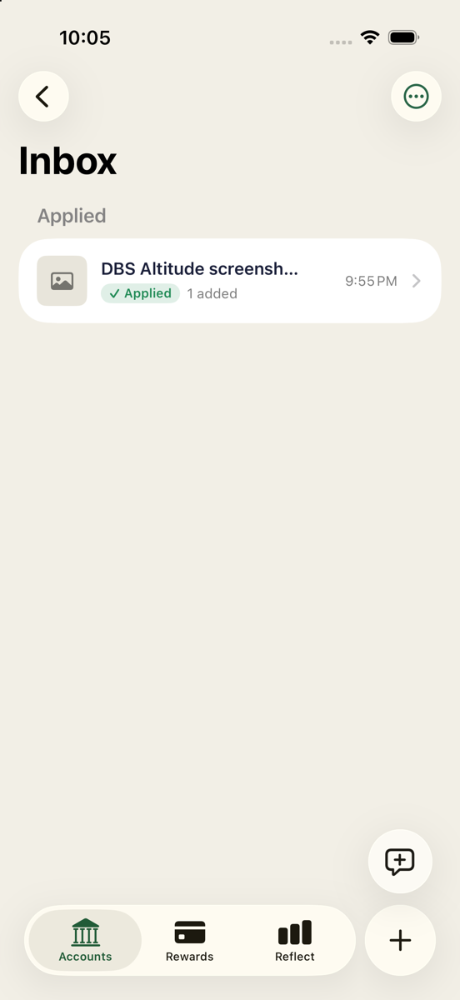

# C — full-review Simulator E2E

Completed runtime procedure on exact detached **15935b7571e3293e75958a899bf7837eb01d1694**. Main full-review assertions passed. One operator error occurred during the initial PDF share; recovery and preserved provenance are described below. No implementation fixes, builds, shell suites, commits, pushes, checkout changes, production access or secrets were used during the runtime procedure. The evidence was committed afterwards onto the latest branch without re-testing it.

Separate exact-revision wrapper test passed: 768 passed, 0 failed, 2 skipped; exit 0; build-for-testing succeeded; command wall time 884.24 seconds.

## Expected versus observed

| Expected | Observed | Result |
|---|---|---|
| Both list and band routes open review | Four paths opened Review, no navigation errors | Pass |
| Source viewer displays both images | Page 1 Kopitiam, Page 2 NTUC | Pass |
| Correct groups/date | NEW NTUC; ALREADY IN Kopitiam; 5 Oct/DBS | Pass |
| Tick/untick controls approval | Untick disabled approval; retick enabled Approve all 1 | Pass |
| Done edits draft only | NTUC FairPrice proposal; ledger/balances unchanged | Pass |
| Approval persists edited row | Two live rows after relaunch, edited NTUC and unchanged Kopitiam | Pass |
| PDF rejection writes nothing | Historical/live rows and balances unchanged | Pass |
| Partial multi-new-row selection | Fixture has only one approvable row | Not exercised |

## Setup and provenance

- Device: existing iPhone 17, iOS 26.5, UDID `EDD9B083-63F1-44E6-9A7B-0A6964CC2561`.
- Xcode: `/Applications/Xcode-27.0-RC.app`; developer dir `/Applications/Xcode-27.0-RC.app/Contents/Developer`.
- Installed supplied product `build/xcode/DerivedData-simulator/Build/Products/Debug-iphonesimulator/HowMuch.app`; bundle `sg.soon.howmuch`, existing local/on-device mode.
- Preserved B ledger in `00-preserved-B-ledger.json` before installation/deletion. B Jobs/Inbox were already preserved by lead under `preserved-pre-test/20261007T043117Z/`.
- Restored fresh live baseline through UI only: DBS register → left swipe on NTUC FAIRPRICE -23.45 → Delete → Delete Transaction. Deleted precisely B ID `txn_5a0cabc1-c688-4c42-8891-a45116d7e610`. No direct DB writes.
- UI deletion is soft deletion. Supplemental read-only queries were explicitly approved by lead after the unfiltered query still returned the old B row. B row has numeric `deleted=1`; seed has `deleted=0`. This tombstone is **not** a C duplicate.
- Baseline `02-ready-baseline.json`: one live transaction `e2e-existing-kopitiam`, 2026-10-05, -8900, Kopitiam, approved 1. DBS balance -8900; Everyday 0; closed synthetic account 0. Two open/one closed accounts; DBS last-used; active Jobs/Inbox empty.
- Dynamic container discovery after installation resolved SQLite at `/Users/devin/Library/Developer/CoreSimulator/Devices/EDD9B083-63F1-44E6-9A7B-0A6964CC2561/data/Containers/Data/Application/30ACC3BA-9E71-4BF6-BC48-E20847930CD3/Library/Application Support/HowMuch/Local/howmuch.sqlite`.

## Procedure and expected versus observed

### 1. Share both sources before approval — passed after operator recovery

Photos → Select the two synthetic images → Share → Halation. Sheet showed two screenshots, DBS Altitude, Auto. Entered `C15935b7 Photos E2E`, Send. Returned to Photos without foregrounding Halation.

Files → synthetic-two-pages.pdf → Preview → Share → Halation. **Operator deviation:** a second coordinate tap intended for note entry landed on Send before the final sheet was inspected. This queued PDF with no note. It was not an app failure. `04-pdf-first-attempt.json` preserves the manifest. Opened Halation, opened this PDF from Accounts band, Reject batch → Discard; no approval. Repeated Files share, inspected final sheet, entered `C15935b7 PDF E2E`, captured `05-pdf-sheet.png`, then Send. Sheet showed `PDF · 2 pages`, `2 pages will be read`, DBS, Auto. Confirmation: `Sent to Halation`.

All shares and this recovery occurred before any approval. The first app foregrounding was necessarily earlier than planned to discard the unintended attempt; the accepted note-labelled screenshot and PDF still saw the same one-live-seed ledger.

Jobs:
- Screenshot `ED0A4BBB-1A80-4CB7-AED9-A111C9311F00`, note `C15935b7 Photos E2E` → final applied.
- Required PDF `1A94A452-535D-4F7A-BE03-CB9978B6754D`, note `C15935b7 PDF E2E` → final discarded.
- Unintended no-note PDF `C7E0A426-EED8-488A-AF74-6D2B5E34B334` → discarded during recovery and never approved.

### 2. Four navigation paths, source pages, groups and reasons — passed

Accounts → See all → screenshot row; back → PDF row; back to Accounts → PDF band row; Close → screenshot band row. **All four opened the full Review screen**, without blank/yellow warning.

Screenshot viewer initially expanded: **Original Page 1 of 2**, synthetic Kopitiam screenshot showing `05 OCT KOPITIAM AMK -8.90`. Swiped left in the viewer: **Page 2 of 2**, matching NTUC screenshot showing `05 OCT NTUC FAIRPRICE -23.45`. Collapsed Original to inspect groups. The page counter and visible fixture changed together.

Both accepted batches showed:

```text
NEW
NTUC FAIRPRICE                    -$23.45
5 Oct · No category · DBS Altitude
Likely

ALREADY IN
KOPITIAM AMK                       -$8.90
Matches 5 Oct in DBS Altitude
Open account
```

There were no FIX or POSSIBLE DUPLICATES groups. NTUC info button opened Why:

```text
Likely · proposed as new
Reasons
No row within 3 days for this amount
Read without Apple Intelligence
```

Already-in row is greyed, has its non-toggleable green check and Open account, not a Why button. Its underlying proposal reasons are `Same amount within 3 days` and `Read without Apple Intelligence`; **these reasons were verified in JSON, not claimed visible in this redesigned UI**. Stored confidence: Kopitiam .85, NTUC .8. Both draft dates `2026-10-05T07:00:00Z`. Screenshot source indices correctly 0 and 1.

Notes were displayed in green bubbles with limitation **“Notes aren’t read yet”**. This differs from B’s “Couldn’t apply this note”; notes were not interpreted.

| Screenshot original, page 1 | Screenshot original, page 2 |
|---|---|
|  |  |

### 3. Reversible selection and draft-only edit — passed

In screenshot Review, tapped NTUC’s tick → empty circle and disabled **“Select rows to approve”**. Snapshot `15-unticked.json`: NTUC decision rejected; historical and active ledger identical to baseline. Reticked → green check and **“Approve all 1”**.

Tapped NTUC row body → Edit draft → Payee → search `NTUC FairPrice` → Create payee “NTUC FairPrice” → returned to Edit draft → Done. Editor retained -$23.45, DBS Altitude and 5 October 2026. Review then displayed exact mixed-case **NTUC FairPrice**. `17-after-done.json` proves proposal changed and is accepted, while **all historical transactions, live transactions and account balances stayed identical to baseline**. No transaction was saved by Done.

**Wording distinction:** with this fixture only NTUC is approvable (Kopitiam already exists), so the selection-aware button is **Approve all 1**, not “Approve selected.” Unticking it disables approval. A partially-selected set of multiple approvable rows was not exercised; no extra proposals were injected to manufacture that state.

| Unticked: approval disabled | After Done: edited proposal, not yet saved |
|---|---|
|  |  |

### 4. UI approval and relaunch persistence — passed

Tapped **Approve all 1**. Dismissed to Accounts with **“1 added · Saved on device”**. Inbox showed screenshot under Applied, `1 added`; required PDF remained Ready. Opened DBS register: exact **NTUC FairPrice -$23.45**, original **Kopitiam -$8.90**, total **-$32.35**.

Terminated and launched main app using simctl, then reopened DBS register. Same edited payee/amount and total visible. `18-after-approval.json` and `21-after-relaunch.json` contain identical historical and active transaction arrays:

```text
id                                          account_id date       amount_milli payee_name_snapshot approved deleted
e2e-existing-kopitiam                        e2e-dbs    2026-10-05 -8900        Kopitiam            1        0
txn_c95b236c-7263-48ac-b9e2-1c620f718dfd       e2e-dbs    2026-10-05 -23450       NTUC FairPrice      1        0
```

One historical tombstone remains, unchanged:

```text
txn_5a0cabc1-c688-4c42-8891-a45116d7e610       e2e-dbs    2026-10-05 -23450       NTUC FAIRPRICE      1        1
```

**Exactly two live rows, three historical rows, one Kopitiam in either count.** Original seed unchanged.

### 5. Required PDF rejection, no write — passed

Accounts → See all → required PDF review. Captured snapshot `22-before-pdf-rejection.json`. Reject batch showed:

```text
Discard this batch?
Nothing was saved.
Cancel / Discard
```

Tapped Discard. PDF disappeared; Inbox showed only applied screenshot. `24-after-pdf-rejection.json`: required PDF discarded, historical **and** active transactions **and** account balances identical to immediately before rejection. No extra NTUC or Kopitiam.

| Persisted after relaunch | PDF removed after UI rejection |
|---|---|
|  |  |

## Runtime log and caveats

The full `runtime.log` is retained locally; only the single exact line below is included in committed `runtime-excerpts.log`. Zero matches for `IntakeRoute`, `navigationDestination`, `NavigationLink`; no observed navigation failure.

Model availability warning persists despite functional deterministic fallback. Exact representative line:

```text
2026-10-06 21:57:41.042 E  HowMuch[20336:31897] [com.apple.modelmanager:IPC] Passing along Model Catalog error: Error Domain=com.apple.UnifiedAssetFramework Code=5000 "There are no underlying assets (neither atomic instance nor asset roots) for consistency token for asset set com.apple.modelcatalog" UserInfo={NSLocalizedFailureReason=There are no underlying assets (neither atomic instance nor asset roots) for consistency token for asset set com.apple.modelcatalog} in response to ExecuteRequest
```

Same Code 5000 also names `com.apple.MobileAsset.UAF.FM.Overrides`; TokenGenerator reports Prewarm failed. No unrelated model diagnostics repeated.

`simctl spawn ... log show` stderr: `getpwuid_r did not find a match for uid 501`, exit 0; log captured successfully.

Limitations: notes intentionally not read; partial multi-row selected wording not reachable with prescribed one-new-row fixture; Already-in reasons are JSON-only in this UI; initial PDF note-entry operator mistake was recovered transparently. No physical-device claim.

## Repeatable commands and evidence

Run from `/Users/devin/repos/howmuch`; these are setup/evidence commands, not test suites:

```sh
export DEVELOPER_DIR=/Applications/Xcode-27.0-RC.app/Contents/Developer
export PATH="$DEVELOPER_DIR/usr/bin:$PATH"
UDID=EDD9B083-63F1-44E6-9A7B-0A6964CC2561
ROOT=.amp/in/artifacts/share-intake/15935b7
git rev-parse HEAD
xcrun simctl install "$UDID" build/xcode/DerivedData-simulator/Build/Products/Debug-iphonesimulator/HowMuch.app
xcrun simctl launch "$UDID" sg.soon.howmuch
python3 "$ROOT/snapshot.py" CHECKPOINT
xcrun simctl io "$UDID" screenshot "$ROOT/SCREENSHOT.png"
xcrun simctl terminate "$UDID" sg.soon.howmuch
xcrun simctl launch "$UDID" sg.soon.howmuch
xcrun simctl spawn "$UDID" log show --start '2026-10-06 21:52:00' --style compact \
  --predicate 'process == "HowMuch" OR process == "HowMuchShareExtension"' > "$ROOT/runtime.log"
```

Snapshot dynamically obtains `data` and `group.sg.soon.howmuch` containers with `simctl get_app_container`; opens SQLite with `mode=ro`. Exact SQL:

```sql
SELECT id, name, closed, balance_milli FROM accounts;
SELECT id, account_id, date, amount_milli, payee_name_snapshot, approved FROM transactions;
SELECT id, deleted FROM transactions;
SELECT id, account_id, date, amount_milli, payee_name_snapshot, approved FROM transactions WHERE deleted = 0;
```

This commit includes only the report, selected downscaled PNGs, original synthetic JSON snapshots/comparisons, and runtime-excerpts.log. Full logs, original-size images, synthetic fixture PNG/PDF files, snapshot helper, test plan, recordings, zip and archived Jobs remain local and are deliberately not committed. Snapshot.py commands above document the original uncommitted helper; its exact read-only queries are listed. No videos, databases, secrets, source files or scripts are included.

Final Simulator left running in DBS register, ledger and all jobs/tombstones preserved. No teardown.

PR-comment suggestion: none (no PR supplied). SKILL.md suggestion: none. Blueprint checked: none exists; setup knowledge worth recording is pinned Xcode/Simulator, dynamic app containers after installs, and soft-deletion-aware read-only evidence. No dependency installs/services needed. User action needed: none.

## Rechecking from a clean checkout

`snapshot.py` above were local helpers and are not committed. These equivalents need only `xcrun`, `sqlite3` and `jq`:

```sh
# Read-only ledger and job state on the booted simulator, at any checkpoint:
DATA=$(xcrun simctl get_app_container booted sg.soon.howmuch data)
sqlite3 -readonly "$DATA/Library/Application Support/HowMuch/Local/howmuch.sqlite" \
  "SELECT id, account_id, date, amount_milli, payee_name_snapshot, approved FROM transactions WHERE deleted = 0"
GROUP=$(xcrun simctl get_app_container booted sg.soon.howmuch group.sg.soon.howmuch)
find "$GROUP/Jobs" -name job.json -exec jq -c '{state, proposals: (.proposals | length)}' {} \;

# Recorded comparisons, against the committed JSON only; lists any check that failed:
jq '[paths(type == "boolean") as $p | select(getpath($p) == false) | $p | map(tostring) | join(".")]' \
  .amp/in/artifacts/share-intake/15935b7/evidence-checks.json
```

Expected from the last command: `[]` (no recorded check failed).
