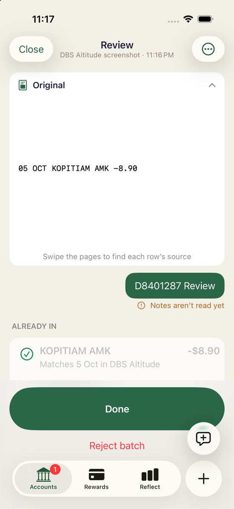
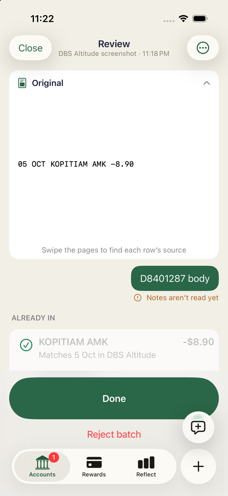
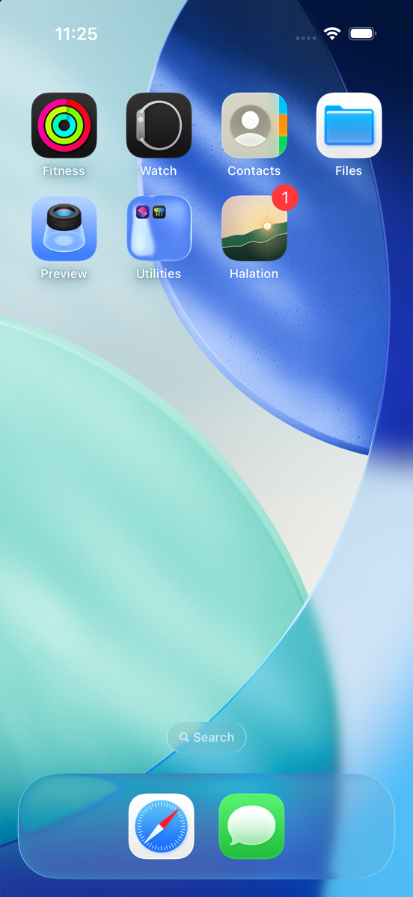
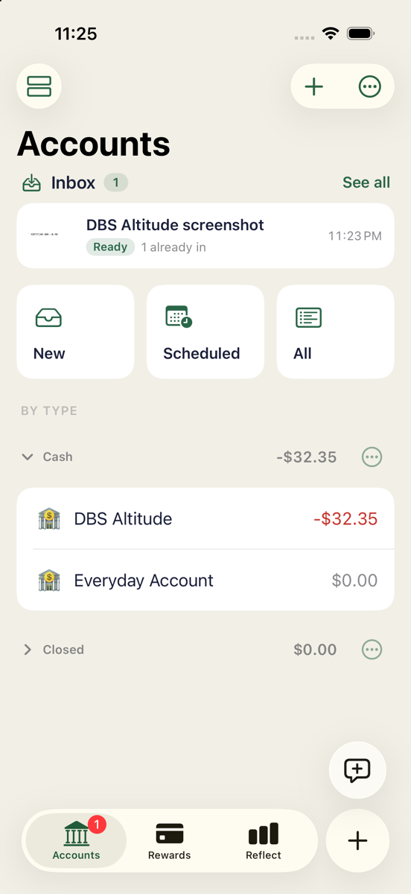

# D notification-action retest — 8401287

## Scope and outcome

Completed real iOS Simulator procedure on exact detached `84012877e314d552e1d6517992004a41d90050e5`. Review, default body, Later and badges passed their acceptance checks. No observed recurrence of the historical main-thread crash. This is runtime UI evidence, not a shell-suite result.

Separate exact-revision wrapper run: 768 passed, 0 failed, 2 skipped; build-for-testing succeeded; exit 0; command wall time 911.04 seconds.

Caveats: collapsed-notification pointer taps initially exposed Open or collapsed swipe controls instead of dispatching; expanded body tapping ultimately dispatched the real default action. View activation was more reliable with a 0.2-second mouse-down/up. Native input retries are retained in the recording. Model-asset Code=5000/Prewarm failed messages continue, but deterministic fallback produced all three Ready batches. Notes visibly say “Notes aren’t read yet”. Actual OS-scheduled background refresh remains unproven; no debugger simulation was repeated.

## Setup and reproducibility

- Existing iPhone 17 / iOS 26.5 Simulator: `EDD9B083-63F1-44E6-9A7B-0A6964CC2561`.
- `DEVELOPER_DIR=/Applications/Xcode-27.0-RC.app/Contents/Developer`.
- Installed supplied `build/xcode/DerivedData-simulator/Build/Products/Debug-iphonesimulator/HowMuch.app` using `xcrun simctl install`; no build, tests, source changes, fixes, checkouts, commits or pushes during the UI procedure.
- Local synthetic plan only, no production or credentials. Existing permission retained from 0bb49dc.
- Lead preserved prior Jobs/Inbox in `preserved-pre-test/`; active baseline Jobs/Inbox empty. Two live transactions and B's historical tombstone retained.
- Original Photos fixture contains `05 OCT KOPITIAM AMK -8.90`; fixture copy `screenshot-1.png`. DBS selected, Auto hint, one screenshot each time.
- Each case: Photos → Share → Halation → distinctive note → Send → native Home; then launch the app and immediately native Home:

```sh
DEVELOPER_DIR=/Applications/Xcode-27.0-RC.app/Contents/Developer \
  xcrun simctl launch EDD9B083-63F1-44E6-9A7B-0A6964CC2561 sg.soon.howmuch
osascript -e 'tell application "System Events" to keystroke "h" using {command down, shift down}'
```

This delivers by real foreground-to-background completion, not injected notification or proven OS background scheduling. Open Notification Center, swipe the notification left → View, then tap Review, the expanded body, or Later. Review/body cleanup is exclusively Reject batch → Discard through UI; final Later batch preserved.

Read-only snapshots: `python3 .amp/in/artifacts/share-intake/8401287/snapshot.py LABEL`. The helper dynamically discovers app/App Group containers and opens SQLite `mode=ro`; the original `snapshot.py` remains local and is not committed. Its established exact read-only queries were:

```sql
SELECT id, name, closed, balance_milli FROM accounts;
SELECT id, account_id, date, amount_milli, payee_name_snapshot, approved FROM transactions;
SELECT id, deleted FROM transactions;
SELECT id, account_id, date, amount_milli, payee_name_snapshot, approved FROM transactions WHERE deleted = 0;
```

No database writes. Expected active baseline:

| ID | Account | Date | Milliunits | Payee | Approved | Deleted |
|---|---|---|---:|---|---:|---:|
| e2e-existing-kopitiam | e2e-dbs | 2026-10-05 | -8900 | Kopitiam | 1 | 0 |
| txn_c95b236c-7263-48ac-b9e2-1c620f718dfd | e2e-dbs | 2026-10-05 | -23450 | NTUC FairPrice | 1 | 0 |
| txn_5a0cabc1-c688-4c42-8891-a45116d7e610 | e2e-dbs | 2026-10-05 | -23450 | NTUC FAIRPRICE | 1 | 1 |

DBS balance `-32350`. Third row is the prior B tombstone, not a new duplicate.

## Expected versus observed

All three notifications visibly said **Ready to review / 1 already in, from 1 DBS Altitude screenshot**. Badge was 1.

| Action | Exact job ID / note | Expected | Observed |
|---|---|---|---|
| Review | `15BB2D3F-600A-4EEA-9B10-2C94EEACE0B9` / `D8401287 Review` | Open matching full review; no crash | PASS. Direct Review screen showed exact note, original Kopitiam screenshot and ALREADY IN row, “Matches 5 Oct in DBS Altitude”. Same app PID 28016 remained alive. Accounts Inbox/tab badge1. Later UI-discarded without ledger mutation. |
| Default body | `DB6D8CF5-5B12-478C-8C09-34868F2289BA` / `D8401287 body` | Open this batch, not earlier Review batch or Inbox | PASS. Expanded notification body opened exact body-labelled Review screen, same PID, no crash. Accounts Inbox/tab badge1. UI-discarded without ledger mutation. |
| Later | `8852B1DD-F29C-4ECA-9874-AAA48F728F57` / `D8401287 Later` | Dismiss notification, no foreground, preserve pending job/count | PASS. Native notification dismissed without foregrounding; Home icon badge1. Manual launch showed Accounts Inbox1/tab1. Opening batch normally showed exact Later note. Job JSON is identical before/after Later and final, state `proposed`, decision `pending`, isApplied=false. |

`01-baseline`, `05-after-review`, `10-after-body`, `14-before-later`, `16-after-later`, and `18-final` raw JSON/TXT establish state; all numbered snapshot checkpoints have byte-equivalent decoded account/transaction/deletion/live-row arrays. Final states: Review discarded, body discarded, Later proposed. Disk Inbox manifests empty because jobs were consumed; UI Inbox contains the proposed Later job, not a lost batch.

## Native action and process evidence

System logs use local PDT timestamps; snapshots are UTC (seven hours later). `notification-system.log` maps native action to the exact persisted job via recordID:

```text
23:17:34.734 actionID = halation.inbox.review
  recordID = 15BB2D3F-600A-4EEA-9B10-2C94EEACE0B9
23:21:47.530 actionID = com.apple.UNNotificationDefaultActionIdentifier
  recordID = DB6D8CF5-5B12-478C-8C09-34868F2289BA
23:24:48.877 actionID = halation.inbox.later; activationMode = 1
  recordID = 8852B1DD-F29C-4ECA-9874-AAA48F728F57
23:24:48.889 Launch application in background for notification response halation.inbox.later
23:24:48.896 Background application launch succeeded for action response halation.inbox.later
```

All three sendResponse completions logged success=1. SpringBoard also logged `BSActionErrorDomain code: 4 ("empty-response")` on handler responses; this did not prevent visible routing/dismissal, completion or process survival. Not represented as a crash.

Runtime captured from 23:14:00 onward using `xcrun simctl spawn DEVICE log show --start '2026-10-06 23:14:00' --style compact --info --debug --predicate 'process == "HowMuch"'`. System predicate: SpringBoard/usernotificationsd messages containing howmuch, halation or UNNotificationDefaultActionIdentifier. `runtime.log` has no “Call must be made on main thread”, “Terminating app”, or “Assertion failure”. Process remained 28016 across all cases. Runtime model errors remain:

```text
Error Domain=com.apple.UnifiedAssetFramework Code=5000
"There are no underlying assets (neither atomic instance nor asset roots)
for consistency token for asset set com.apple.modelcatalog"
Prewarm failed: Model Catalog error
```

## Historical failure — 0bb49dc only

Earlier exact `0bb49dc95bdd9f87d982f164edc06c18253f62ea` delivered notifications but Review crashed. This is **not** a crash on 8401287. The committed `historical-0bb49dc/` subdirectory contains selected original screenshots, synthetic state/comparison JSON and exact runtime crash excerpts; full historical logs/report/recording remain local and are excluded.

Historical runtime lines 6729–6739:

```text
2026-10-06 22:50:29.650 E HowMuch[24511:3d65f]
*** Assertion failure in -[...SwiftUIApplication
_performBlockAfterCATransactionCommitSynchronizes:], UIApplication.m:3426
2026-10-06 22:50:29.667 Df HowMuch[24511:3d65f]
*** Terminating app due to uncaught exception 'NSInternalInconsistencyException',
reason: 'Call must be made on main thread'
...
6 HowMuch ... IntakeNotificationDelegate ... userNotificationCenter ... didReceive
```

No separate historical crash report was found in previously checked host/Simulator log directories. New revision's completion-handler/main-queue fix was exercised via native actions, not direct delegate calls.

Historical duplicate warning/Close and clipboard screenshot-offer checks passed on 0bb49dc; these unrelated features were not rerun on 8401287. Background task simulation previously reported no scheduled task request; no OS-scheduled execution claim.

## Visual evidence

| Review opens matching note | Default body opens matching note |
|---|---|
|  |  |

| Later leaves Home badge1 | Manual launch retains Inbox1 and tab1 |
|---|---|
|  |  |

Committed PNG copies are downscaled to at most 1200px long edge without cropping. Original captures, recordings, full logs, helper, fixture, hash manifest and zip remain local and are not committed. `evidence-checks.json` is frozen comparison/process evidence; `native-action-excerpts.log` preserves extracted exact action lines. Only report, selected PNGs, synthetic JSON, runtime/action/crash excerpts are included. Raw TXT snapshots, full `runtime.log` and full system logs remain local; only selected snapshots and excerpts are committed.

## Preservation and remaining work

Simulator remains running in Accounts, one pending Later job, unchanged ledger, archived earlier jobs intact. No teardown. No user input needed. Artifact publication is completed afterwards on the current branch head; no new retest of that branch-head code was run.

No PR was specified, so suggested PR comment: none. No SKILL file created. Blueprint checked: none exists; suggested setup knowledge is pinned Xcode/Simulator, dynamic container discovery, real native Home timing and explicit distinction between background completion and OS scheduling. No dependencies, credentials or services installed.

## Rechecking from a clean checkout

`snapshot.py` above were local helpers and are not committed. These equivalents need only `xcrun`, `sqlite3` and `jq`:

```sh
# Read-only ledger and job state on the booted simulator, at any checkpoint:
DATA=$(xcrun simctl get_app_container booted sg.soon.howmuch data)
sqlite3 -readonly "$DATA/Library/Application Support/HowMuch/Local/howmuch.sqlite" \
  "SELECT id, account_id, date, amount_milli, payee_name_snapshot, approved FROM transactions WHERE deleted = 0"
GROUP=$(xcrun simctl get_app_container booted sg.soon.howmuch group.sg.soon.howmuch)
find "$GROUP/Jobs" -name job.json -exec jq -c '{state, proposals: (.proposals | length)}' {} \;

# Recorded comparisons, against the committed JSON only; lists any check that failed:
jq '[paths(type == "boolean") as $p | select(getpath($p) == false) | $p | map(tostring) | join(".")]' \
  .amp/in/artifacts/share-intake/8401287/evidence-checks.json
```

Expected from the last command: `[]` (no recorded check failed).
