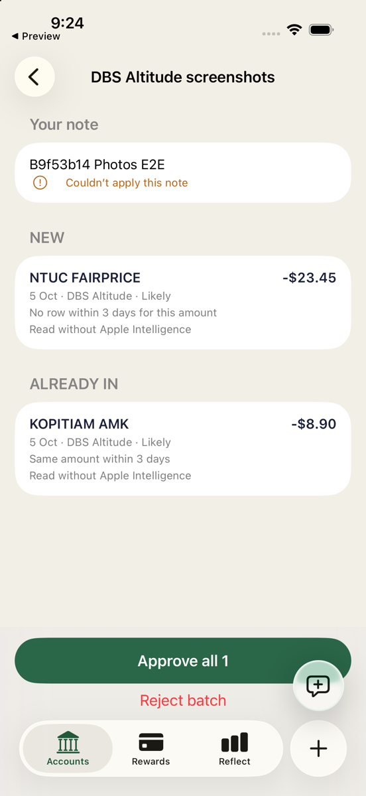
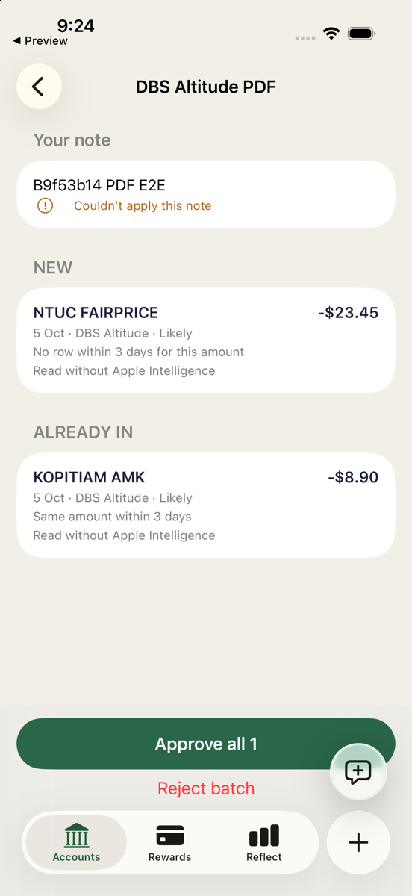
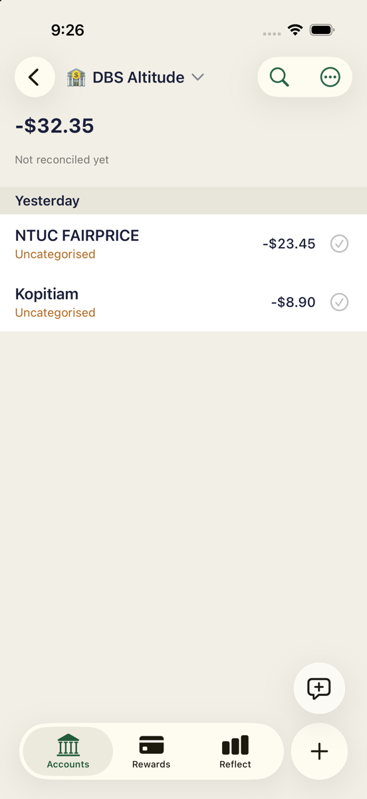
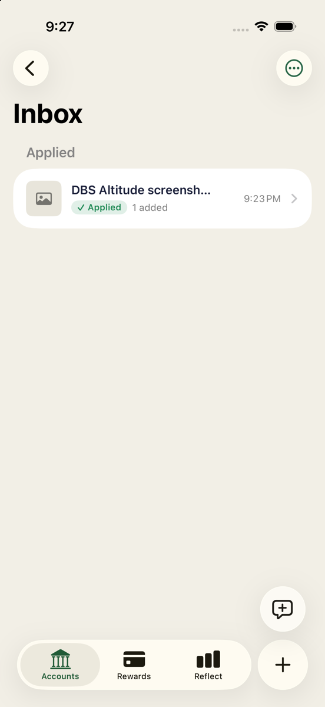

# PR 2 Simulator E2E — 9f53b14

Tested **9f53b14ab7f49388fec6389d88f33c2dd70a4e1e** on 2026-10-07, 04:22–04:28 UTC. All requested B acceptance checks passed through the real Photos/Files share extensions and Halation UI, with read-only SQLite evidence. This is exact-revision evidence, not a retest of the branch head receiving this artifact commit.

## Environment and fresh baseline

- macOS 26.6.2; Xcode 27 RC at `/Applications/Xcode-27.0-RC.app`.
- Existing iPhone 17 / iOS 26.5 Simulator, UDID `EDD9B083-63F1-44E6-9A7B-0A6964CC2561`.
- Bundle `sg.soon.howmuch`; local/on-device SQLite backend. No production access, credentials, certificate signing or external API.
- The exact-revision wrapper run succeeded: **768 passed, 0 failed, 2 skipped**, exit 0; command wall time 922.95 seconds. This count comes from xcresult, not summed log retries.
- Before testing, historical synthetic Jobs/Inbox directories were moved into a preserved local archive and replaced with empty directories. No ledger reset was needed. Archives, databases, complete logs and videos remain local and are deliberately not committed.
- [01-ready-baseline.json](01-ready-baseline.json): open DBS Altitude (`e2e-dbs`) and Everyday Account; closed Closed Synthetic Account; last-used account DBS; one approved Kopitiam transaction dated 2026-10-05, amount -8900 milliunits; empty active Jobs/Inbox.
- Fixtures: two PNGs containing `05 OCT KOPITIAM AMK -8.90` and `05 OCT NTUC FAIRPRICE -23.45`; a two-page PDF with those lines on separate pages. These existing synthetic fixtures were reused from the earlier run, not production documents.

## Exact steps, expected and observed

| UI action / expected outcome | Observed evidence | Result |
|---|---|---|
| Photos → Select both PNGs → Share → Halation; DBS, Auto, note | `2 screenshots`; note `B9f53b14 Photos E2E`; Send confirmation, return to Photos | Pass |
| Files → synthetic PDF → Share → Halation; DBS, Auto, note | `PDF · 2 pages · 8 KB`; note `B9f53b14 PDF E2E`; Send returns to Preview | Pass |
| Send both before opening Halation or approving | [05-both-shares-before-open.json](05-both-shares-before-open.json): 2 Inbox manifests, 0 Jobs, original ledger unchanged | Pass |
| Accounts → See all → screenshot row; Back → PDF row | Both open real batch details; see screenshots 07 and 08 | Pass |
| Back to Accounts → each batch's Inbox-band row | Both open real details; screenshots 09 and 10; no blank/yellow warning screen | Pass |
| Both batches: Kopitiam ALREADY IN, NTUC NEW, October 5 | Both show these groups, dates and DBS account; no FIX or POSSIBLE DUPLICATES groups | Pass |
| Reasons and confidence visible | Both rows show `Read without Apple Intelligence` and `Likely`; stored confidence .85 Kopitiam/.8 NTUC | Pass |
| Nothing saved before approval | [11-before-approval.json](11-before-approval.json): one original transaction, both jobs proposed | Pass |
| Screenshot detail → Approve all 1 | `1 added · Saved on device`; screenshot batch Applied, only NTUC Applied | Pass |
| DBS register and read-only DB after approval | Original Kopitiam unchanged; one new NTUC -23.45; total -32.35 | Pass |
| Terminate/relaunch → DBS register | Same rows; [16-after-relaunch.json](16-after-relaunch.json) matches after-approval transactions | Pass |
| PDF detail → Reject batch → Discard | Confirmation `Discard this batch?` / `Nothing was saved.`; PDF removed from visible Inbox, job discarded | Pass |
| Reject writes nothing | Transaction arrays in snapshots 17 and 19 identical | Pass |
| Capture navigation errors | Zero `IntakeRoute`, `navigationDestination`, `NavigationLink` matches in the captured full runtime log | Pass |

## Exact visible batch contents

Both `DBS Altitude screenshots` and `DBS Altitude PDF` showed:

```text
NEW
NTUC FAIRPRICE                     -$23.45
5 Oct · DBS Altitude · Likely
No row within 3 days for this amount
Read without Apple Intelligence

ALREADY IN
KOPITIAM AMK                       -$8.90
5 Oct · DBS Altitude · Likely
Same amount within 3 days
Read without Apple Intelligence

Approve all 1
Reject batch
```

Both persisted draft dates: `2026-10-05T07:00:00Z`.

- Screenshot job `D4B0E7A8-F960-4668-85D6-705182CF0A87`: proposed → applied; `appliedSummary: "1 added"`.
- PDF job `4EE67DE8-1EC6-4389-BB87-8EC28925E57D`: proposed → discarded.

## Persisted result

Exact read-only query:

```sql
SELECT id, account_id, date, amount_milli, payee_name_snapshot, approved FROM transactions;
```

```text
id                                       account_id date        amount_milli payee_name_snapshot approved
e2e-existing-kopitiam                     e2e-dbs    2026-10-05  -8900        Kopitiam            1
txn_5a0cabc1-c688-4c42-8891-a45116d7e610    e2e-dbs    2026-10-05  -23450       NTUC FAIRPRICE      1
```

The original Kopitiam row is identical across snapshots. No second Kopitiam exists. After relaunch and PDF rejection the ledger remains exactly these two rows. [evidence-checks.json](evidence-checks.json) records checkpoint comparisons from the completed run. The register's relative `Yesterday` label reflects the host's Oct 6 local date; the database dates are October 5.

## Caveats

- Both notes were retained but displayed **“Couldn’t apply this note”**. Notes were not applied as transaction instructions; the batch still completed.
- Model asset **Code=5000** remained, but deterministic fallback succeeded. [runtime-excerpts.log](runtime-excerpts.log) contains the exact representative error from the original capture; it is intentionally not the complete runtime log.
- No App Intent, later revision, physical-device or production behavior is claimed here.

## Commands and reproducibility

From repository root, after building the exact revision with `scripts/ios-xcodebuild.sh test`:

```sh
export DEVELOPER_DIR=/Applications/Xcode-27.0-RC.app/Contents/Developer
export PATH="$DEVELOPER_DIR/usr/bin:$PATH"
UDID=EDD9B083-63F1-44E6-9A7B-0A6964CC2561
R=.amp/in/artifacts/share-intake/9f53b14
git rev-parse HEAD
xcrun simctl install "$UDID" build/xcode/DerivedData-simulator/Build/Products/Debug-iphonesimulator/HowMuch.app
xcrun simctl launch "$UDID" sg.soon.howmuch
xcrun simctl launch "$UDID" com.apple.mobileslideshow
# Execute Photos sequence in the table.
xcrun simctl launch "$UDID" com.apple.DocumentsApp
# Execute PDF sequence, then launch Halation and follow table order.
xcrun simctl launch "$UDID" sg.soon.howmuch
# After screenshot approval and initial register/DB check:
xcrun simctl terminate "$UDID" sg.soon.howmuch
xcrun simctl launch "$UDID" sg.soon.howmuch
# Recheck register/DB, then reject PDF as above.
xcrun simctl spawn "$UDID" log show --last 9m --style compact \
  --predicate 'process == "HowMuch"'
xcrun simctl io "$UDID" screenshot "$R/NAME.png"
```

The local snapshot helper was called at baseline, after each share, before approval, after approval, after relaunch, and before/after PDF rejection. It dynamically resolved containers with `xcrun simctl get_app_container "$UDID" sg.soon.howmuch data` and `... group.sg.soon.howmuch`, then opened `Library/Application Support/HowMuch/Local/howmuch.sqlite` with Python `sqlite3.connect("file:" + path + "?mode=ro", uri=True)`. It queried the transaction SQL above and `SELECT id, name, closed, balance_milli FROM accounts`, and read `Intake/share-context.json`, `Inbox/**/*.json`, and `Jobs/**/job.json`. The committed snapshots are the captured results, not later recomputations. No direct approval/backend write or proposal injection was used.

For a repeat, first preserve the current synthetic state and establish the same one-Kopitiam baseline; the completed run intentionally leaves NTUC saved. Do not replay against production or overwrite current state without authorization.

## Key screenshots

PNG copies are downscaled without cropping to at most 1200px on their long edge; original captures remain local.

| Screenshot batch | PDF batch |
|---|---|
|  |  |

| Register after relaunch | Inbox after rejection |
|---|---|
|  |  |

Other PNGs cover both share sheets, Send confirmation, Accounts-band entry paths, approval confirmation, and PDF rejection confirmation. Only this report, selected PNGs, synthetic JSON snapshots/comparisons and a runtime excerpt are committed. No videos, databases, fixture binaries, scripts or full build/runtime logs are included.
