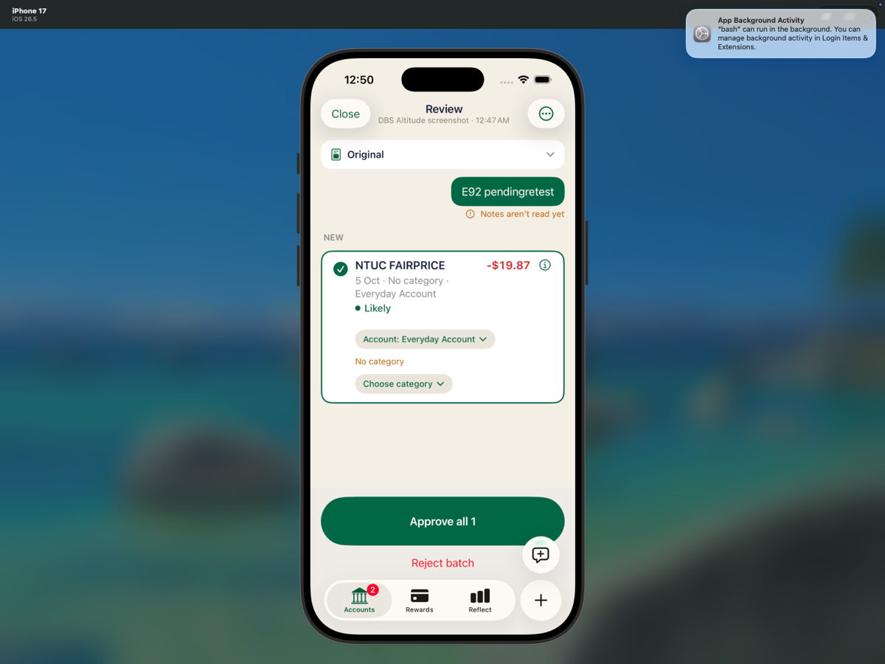
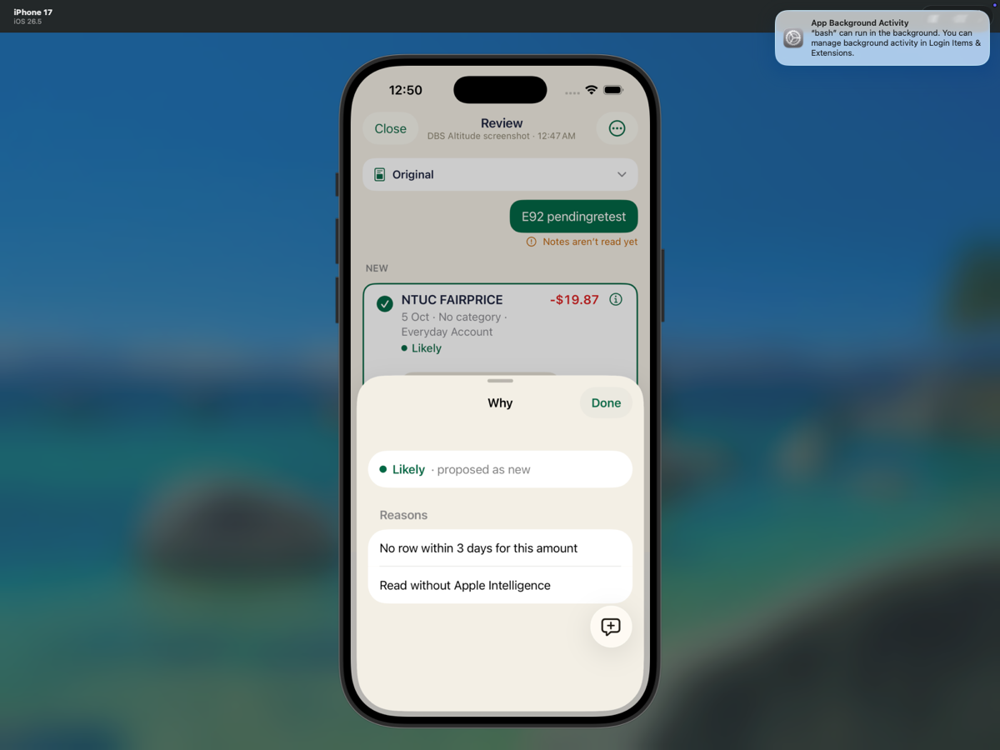

# Focused fallback-provenance retest

**Exact revision:** `e92a0797103d7fd07fb5ce0a9652ac01e616836e`

Completed the requested real Simulator rule-deletion and same-row account-change procedure. Both focused assertions passed: the fresh pending NEW row retained **Read without Apple Intelligence** and **0.8 / Likely** at both checkpoints. No target transaction was approved.

## Scope and environment

- Existing iPhone 17 / iOS 26.5 Simulator `EDD9B083-63F1-44E6-9A7B-0A6964CC2561`, Xcode `/Applications/Xcode-27.0-RC.app`.
- Installed supplied fresh `build/xcode/DerivedData-simulator/Build/Products/Debug-iphonesimulator/HowMuch.app`; launched host before extension to refresh local context.
- Lead-supplied exact-revision shell gate: 823 passed / 0 failed / 2 skipped (825 total); IntakeSkillTests 55 passed / 0 failed / 0 skipped; wrapper exit 0; wall time 867.96 s. Not rerun by this UI procedure.
- Existing isolated local synthetic data; no production, credentials, services, DB writes, jobs/proposal/rule injection, debugger bypass, resets, builds, source/test edits, fixes, signing, commits or pushes during the UI procedure. The separately published evidence-only commit lands on the fetched branch head and does not validate newer code.
- Original baseline: 3 live transactions plus B tombstone, DBS -44.69, Everyday 0, rules=[].
- Existing old pending `1C7BB734-12AD-41E3-96D6-1FCD80D8FA02` was not used as the target. Its already-lost provenance is not claimed repaired. Entire old job JSON is identical baseline→final.
- A row reordering while the setup batch changed Reading→Ready caused one accidental opening of the historical batch; immediately closed without interaction or mutation. Note entry needed a second tap because the extension was still appearing. Neither produced additional shares or data changes.
- No extra previous scenarios or relaunch retest performed. Final screen remains the new target's Why.

## Repeatable setup and interaction sequence

Fixtures generated by the included artifact-only `make-fixtures.swift`:

```text
E92-learnsetup.png: 05 OCT NTUC FAIRPRICE -18.76
E92-pendingretest.png: 05 OCT NTUC FAIRPRICE -19.87
```

Commands executed from repo root (reuse existing synthetic local state; do not reset it):
```sh
export DEVELOPER_DIR=/Applications/Xcode-27.0-RC.app/Contents/Developer
xcrun simctl install EDD9B083-63F1-44E6-9A7B-0A6964CC2561 build/xcode/DerivedData-simulator/Build/Products/Debug-iphonesimulator/HowMuch.app
xcrun simctl launch EDD9B083-63F1-44E6-9A7B-0A6964CC2561 sg.soon.howmuch
swift .amp/in/artifacts/share-intake/e92a079/make-fixtures.swift .amp/in/artifacts/share-intake/e92a079
xcrun simctl addmedia EDD9B083-63F1-44E6-9A7B-0A6964CC2561 .amp/in/artifacts/share-intake/e92a079/E92-learnsetup.png .amp/in/artifacts/share-intake/e92a079/E92-pendingretest.png
python3 .amp/in/artifacts/share-intake/e92a079/snapshot.py CHECKPOINT
```

1. Authorized necessary rule setup: Photos -18.76 PNG → Share → Halation → DBS Altitude / Auto / note `E92 learnsetup` → Send. Open NEW row → Category → Groceries → Done → Approve all 1 → Remember. Default DBS scope unchanged.
2. Fresh target: Photos -19.87 PNG → Share → Halation → DBS / Auto / note `E92 pendingretest` → Send. Open newest batch, collapse Original, tap NEW info button.
3. Capture pre-deletion Why and snapshot. Close Why/review → Accounts overflow → Settings → Intelligence / Skill & Memory → NTUC rule → Delete rule → confirmation Delete.
4. Return exact target batch, collapse Original, reopen NEW Why; capture after-deletion checkpoint.
5. Done on Why → tap same NEW row → Account → Everyday Account → Done. Open same info button; capture final Why and read-only checkpoint. Do not approve.

## Expected versus observed

| Checkpoint / expected | Observed | Result |
|---|---|---|
| Setup creates one -18.76 Groceries ledger row and DBS rule | Exactly one new approved/live row and account-scoped rule; all previous ledger rows unchanged | Passed, 04 snapshot |
| Fresh NEW -19.87 has learned Groceries and fallback provenance; confidence <=.85 | Groceries; learned reason and `Read without Apple Intelligence`; JSON .8, visible Likely | Passed, 06/07 screenshots + 07 snapshot |
| Rule deletion removes learned effect, not fallback provenance | rules=[]; No category; no learned reason/application; exact fallback reason retained, .8 / Likely | Passed, 10/11 screenshots + 11 snapshot |
| Same-row account change preserves provenance/cap | Everyday Account visible; `draft.accountID=e2e-everyday`; fallback retained, .8 / Likely | Passed, 12–15 screenshots + 15 snapshot |
| Neither deletion nor account edit saves target or changes ledger | Accounts, all historical/category-aware transactions, live transactions and deletion flags identical to post-setup; target remains proposed/pending/isApplied=false | Passed, comparison JSON |
| Preserve older state | Old pending JSON identical baseline→final, 3 prior live rows and B tombstone unchanged | Passed |

### Exact target identity and reasons

Job: `BC80D393-096A-4700-9F9B-44F3C8E78ADC`

Proposal: `A254D1AD-CAD2-4B27-BFD4-6488892BD8DD`

Amount: `19870` magnitude/outflow (-19.87), date `2026-10-05`.

| Checkpoint | Account | Confidence / visible label | Exact reasons |
|---|---|---|---|
| Before deletion | e2e-dbs | 0.8 / Likely | `Learned rule: NTUC FAIRPRICE → Groceries (from 1 correction)`; `No row within 3 days for this amount`; `Read without Apple Intelligence` |
| After deletion | e2e-dbs | 0.8 / Likely | `No row within 3 days for this amount`; `Read without Apple Intelligence` |
| After account Done | e2e-everyday | 0.8 / Likely | `No row within 3 days for this amount`; `Read without Apple Intelligence` |

The same job and proposal IDs appear at all three checkpoints. Both final reasons are visible in captured native Why sheets. No category or learned application remains after deletion.

### Necessary setup write, separately documented

Setup job: `D11D697C-B857-4C31-94AC-2417FA036435`.

Rule created then deleted: `0767572B-9EB6-49E9-818C-141F7F41DFDD`, enabled, scope `{"kind":"account","value":"e2e-dbs"}`, payeeToken `ntuc fairprice`, category Groceries.

One saved setup transaction:
```text
txn_bdad6012-10e4-49e1-9410-f8bc52e0acc4
e2e-dbs | 2026-10-05 | -18760 | NTUC FAIRPRICE
category_id=starter:plan_613b3d02-e28b-4c3b-b514-afaf3deb047e:cat:groceries
category_name_snapshot=Groceries | approved=1 | deleted=0
```

Final totals: **4 live rows / 5 historical including B tombstone**, DBS **-63.45**, Everyday **0**. No -19.87 transaction exists. Two pending batches remain (old and target); two setup/earlier applied batches remain. All runtime data preserved.

## Visual evidence

| 🔴 Before deletion: rule + fallback | 🟢 After deletion: fallback retained |
|---|---|
|  |  |

| Same row changed to Everyday | Why after account Done |
|---|---|
|  |  |

Only selected downscaled PNG copies are included in this publication; original-size captures remain local. macOS showed an unrelated background-activity notification outside the Simulator; it did not obscure tested UI.

## Runtime, coverage and caveats

No failed focused assertion or blocked acceptance step. Notes still show `Notes aren’t read yet`; model assets remain unavailable, which triggers the actual fallback required for this test:
```text
Error Domain=com.apple.UnifiedAssetFramework Code=5000 "There are no underlying assets (neither atomic instance nor asset roots) for consistency token for asset set com.apple.modelcatalog"
Prewarm failed
```
Also logged for `com.apple.MobileAsset.UAF.FM.Overrides`. Runtime has 8 `Code=5000` and 2 `Prewarm failed` occurrences; zero `Call must be made on main thread`, `Terminating app`, `Assertion failure`, `navigationDestination` or `IntakeRoute` matches.

Log capture:
```sh
xcrun simctl spawn EDD9B083-63F1-44E6-9A7B-0A6964CC2561 log show --style compact --start '2026-10-07 00:43:00' --predicate 'process == "HowMuch" OR process == "Halation" OR process == "HowMuchShare"'
```

Confidence <=0.85 is proven for this actual fallback flow at 0.8; no artificial high-confidence match was injected. No historical migration, other learned-rule variations or model-based extraction claim.

Source grounding for the focused plan: `IntakeCoordinator.swift:1115–1147` preserves the existing fallback reason/cap during rematch; account editor at `TransactionFormView.swift:573`, Done at :314. The report's functional claims come from UI/runtime evidence, not these source references.

## Evidence and handoff

- This artifact-only publication contains only the report, selected synthetic JSON snapshots and comparison evidence, selected numbered PNG copies downscaled to at most 1200 px on the long edge without cropping, and `runtime-excerpts.log`.
- The full Simulator recording/video, full runtime and system logs, `snapshot.py`, `evidence-checks.py`, `test-plan.md`, numbered TXT checkpoints, original-size screenshots, fixture PNGs and generator, `SHA256SUMS.txt`, zip archive, and shell-test artifacts remain local and are deliberately excluded.
- The exact read-only SQL statements from the local `snapshot.py` helper are:

```sql
SELECT id, name, closed, balance_milli FROM accounts
SELECT id, account_id, date, amount_milli, payee_name_snapshot, approved FROM transactions
SELECT id, deleted FROM transactions
SELECT id, account_id, date, amount_milli, payee_name_snapshot, approved FROM transactions WHERE deleted = 0
SELECT id, account_id, date, amount_milli, payee_name_snapshot, category_id, category_name_snapshot, approved, deleted FROM transactions
SELECT id, name, category_group_id, hidden, internal, deleted FROM categories
SELECT name FROM sqlite_master WHERE type='table'
```

- `evidence-checks.json` preserves the frozen read-only comparisons, including the unchanged old pending job and never-approved target.

Suggested PR comment: none; no PR supplied.
SKILL.md suggestions: none.
Blueprint checked; none exists. Suggested setup knowledge: supplied exact product and pinned Xcode/Simulator, launch host after install before extension, dynamic read-only container snapshots, distinguish approved setup write from never-approved target. No dependencies or services installed.
Needed from user: none. No teardown. This publication contains evidence for the exact `e92a079` revision only; no newer code was tested.
