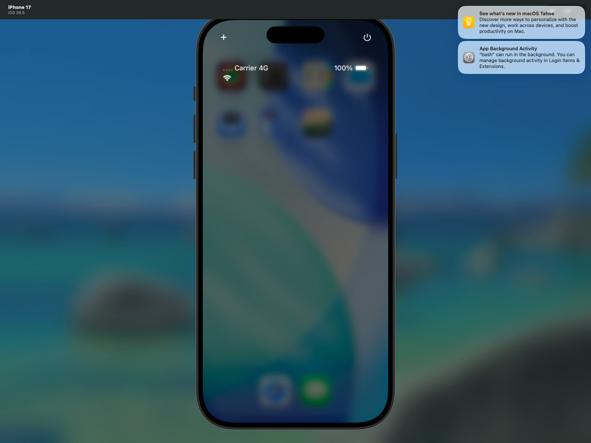
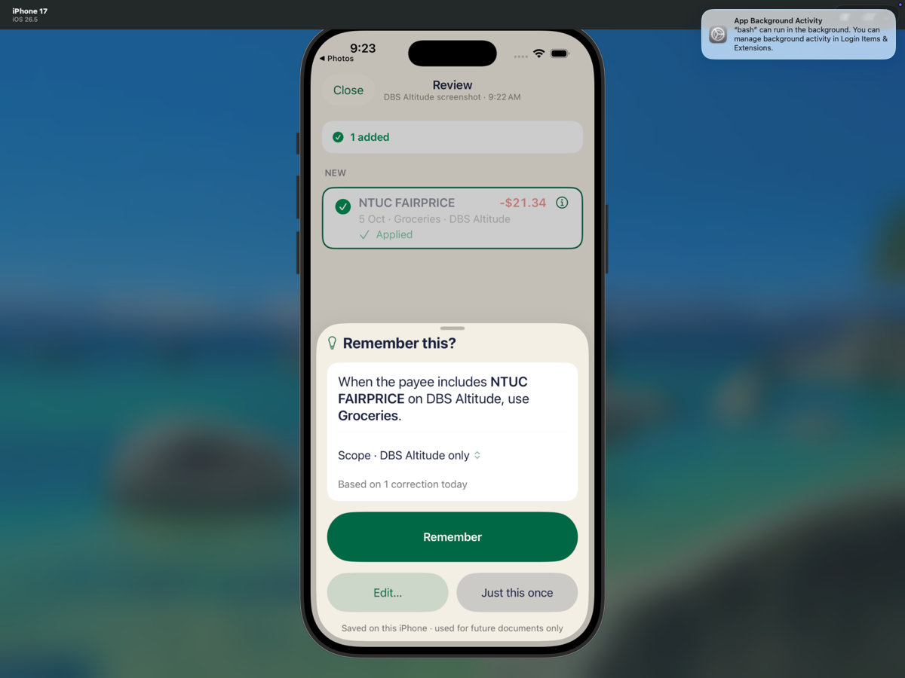
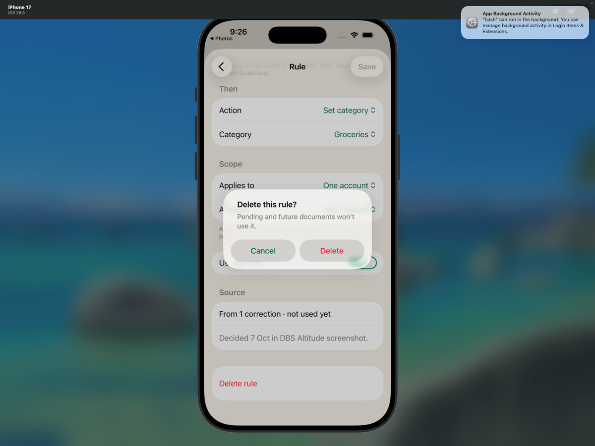
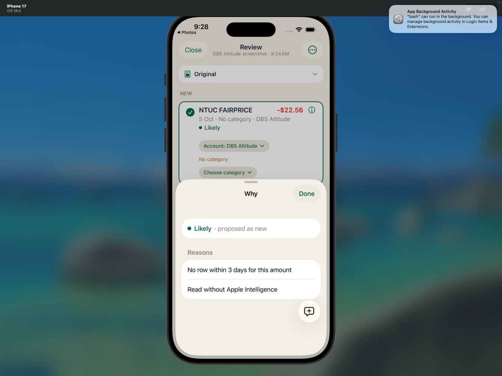
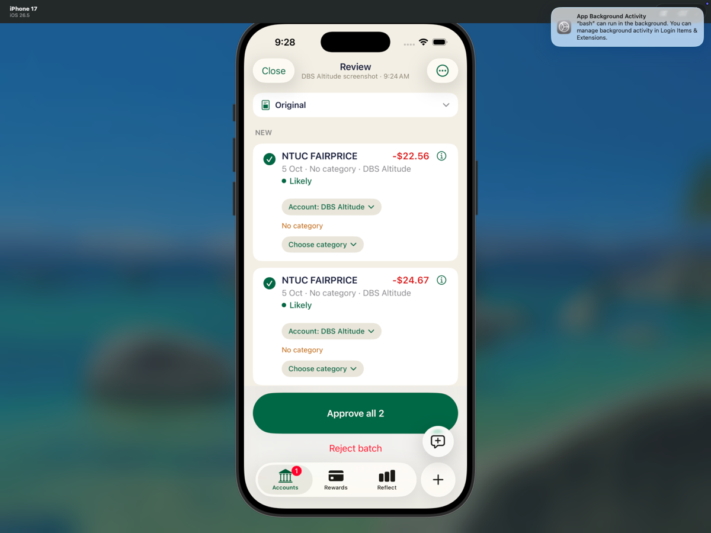
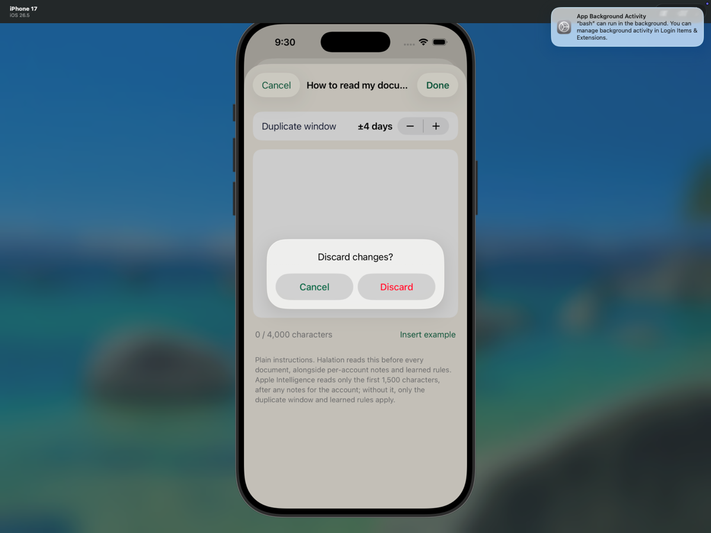
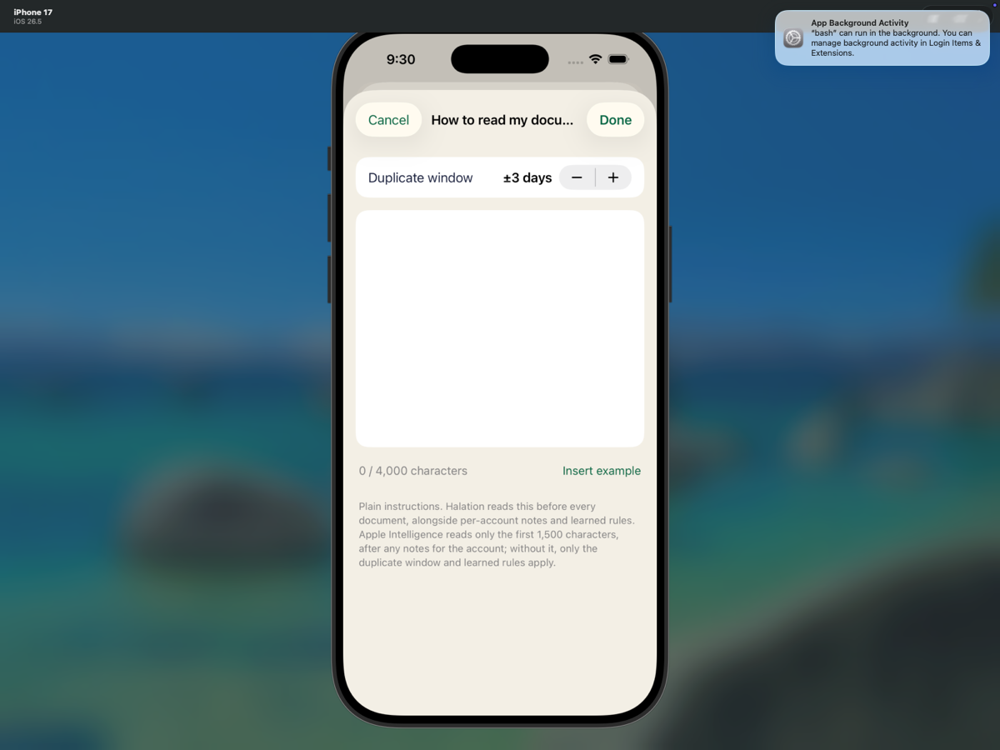

# Skill & Memory native UI — exact f9f98de

Completed the normal on-device Remember/delete and dirty-editor Cancel procedure using native Photos sharing, iOS UI actions, an annotated local recording and read-only snapshots. **Normal deletion passed; offline-specific deletion remains UNTESTED.** The normal-delete result is not offline coverage.

## Scope and environment

- Revision: `f9f98de72752a9010292c2d30b3958b34d1a13ad`.
- iPhone 17 / iOS 26.5, device `EDD9B083-63F1-44E6-9A7B-0A6964CC2561`.
- Installed the supplied `build/xcode/DerivedData-simulator/Build/Products/Debug-iphonesimulator/HowMuch.app`; no rebuild, source/test edits, checkout, commit or push.
- Used existing synthetic on-device local mode, never production authentication or API approval. Read-only SQLite helper reused the authorized queries, including categories and deletion flags. All rule, draft and approval changes were native UI actions.
- Prior Jobs/Inbox, including the natural Failed job, preserved under `preserved-pre-test/`. Archived job JSON matches the initial snapshot. Ledger history was not deleted.
- Initial ledger: 4 live / 6 historical transactions, DBS -$63.45. Final: 5 live / 7 historical, DBS -$84.79. The only additional transaction is the necessary -$21.34 Groceries setup approval.

## Frozen shell validation

A fresh `scripts/ios-xcodebuild.sh test` run used exact revision `f9f98de72752a9010292c2d30b3958b34d1a13ad`, Xcode 27.0 RC (27A266a), ad-hoc Simulator signing, existing DerivedData, and the iPhone 17 / iOS 26.5 simulator.

- Build-for-testing: exit 0 (82s). Test-without-building: exit 0 (927s). Wrapper exit 0.
- **851 total: 849 passed, 0 failed, 2 skipped.**
- `IntakeSkillTests`: 56 passed, 0 failed, 0 skipped; `IntakeLineParserTests`: 43 passed, 0 failed, 0 skipped; `IntakeMatcherTests`: 26 passed, 0 failed, 0 skipped.
- Skipped: `CaptureInterpreterTests/testLiveFoundationModelsCoffeeAddUpdateAndTodayQuery()` and `LocalModeTests/testLocalModeScreensRender()`.
- UTC: 2026-10-07 16:00:07–16:17:02. `/usr/bin/time -p`: real 1010.18s, user 144.13s, sys 24.91s.
- No compiler errors. Xcode timed out collecting Simulator diagnostics after 600s; test execution succeeded. The result records three runtime warnings in `AddTransactionsView.swift`.

These shell results are separate from the UI observations below.

## Limitation: genuine offline condition unavailable

Native Simulator Control Center exposed no usable Airplane/Wi-Fi toggle; the Simulator menu had no network control and `simctl help` had no network subcommand. Screenshot `00-unavailable-connectivity-controls.png` documents the visible limitation. No independent target-only disconnection could be established. Per lead guidance, no host/VM network disable, cosmetic status-bar override, unverified proxy/firewall, or broad control search was attempted.

**UNTESTED:** deletion under an independently verified offline network condition. No before/after-offline state or offline relaunch claim is made. The host network remained unchanged.

## Results

| Test/action | Expected | Observed |
|---|---|---|
| Photos share fresh -21.34 via Halation, DBS/Auto; edit category → Groceries → Done | Draft only until approval | **Passed.** Accounts, ledger, categories and deletion flags identical to baseline before approval |
| Approve all 1 → Remember | Save setup row; create DBS-scoped learned category rule | **Passed.** One approved Groceries transaction and one enabled rule |
| Share fresh -22.56 / -24.67 with saved -23.45 guard line | Two untouched NEW Groceries rows, learned Why, fallback provenance; saved row unaffected | **Passed.** Both NEW rows Included/ticked, Likely/0.8. -23.45 ALREADY IN, no applied rule/category |
| Delete rule confirmation | Exact new copy | **Passed.** `Delete this rule?` / `Pending and future documents won’t use it.` |
| Confirm Delete, with normal networking unchanged | Rule removed; both NEW ticks and confidence preserved; category/rule effect removed; fallback remains | **Passed.** `rules=[]`, both Included, Approve all 2, confidence 0.8, no category, fallback Why retained |
| Normal terminate/relaunch | Same pending batch and persisted absent rule | **Passed.** Job JSON identical to post-delete, both ticks visible, 0.8 confidence and fallback reasons retained |
| Skill file: Duplicate window + once, Cancel | Dirty edit confirmation | **Passed.** ±3 → ±4 days; visible `Discard changes?` |
| Confirm Discard, reopen | No saved skill edit | **Passed.** ±3 days restored; full skill JSON identical to pre-editor snapshot |
| Offline-specific deletion | Establish a verified target-only offline state and repeat deletion | **UNTESTED.** No target-only disconnect was verified; host networking remained unchanged. |

### Exact Remember sheet

```text
Remember this?
When the payee includes NTUC FAIRPRICE on DBS Altitude, use Groceries.
Scope · DBS Altitude only
Based on 1 correction today
Remember
Edit…
Just this once
Saved on this iPhone · used for future documents only
```

Setup job: `7653A7BF-754F-4A91-B7B7-67617570DEDE`.
Saved setup transaction: `txn_d1093158-783a-47c2-bbe4-6573da079e27`, e2e-dbs, 2026-10-05, -21340 milli, NTUC FAIRPRICE, Groceries, approved=1, deleted=0.
Learned rule: `37D8305A-A52D-47EB-91BD-F8C19030D02D`, enabled, account scope `e2e-dbs`, subsequently deleted.

### Exact pending identity and checkpoints

Target job: `2CD737C5-7ACA-47E9-A39A-F85D3ABB53D8`, `proposed`.

| Proposal / amount | Before delete | After normal delete | After relaunch |
|---|---|---|---|
| `F4F82A16-EA6E-4014-AB59-44D17BDEDBE6` / -22.56 | Included; 0.8; Groceries | Included; 0.8; no category | Included; 0.8; no category |
| `73CFB5C1-7000-4765-B99E-B40AEF5641EB` / -24.67 | Included; 0.8; Groceries | Included; 0.8; no category | Included; 0.8; no category |
| `21C8E532-F729-4FEE-A453-36CBA4F4F34A` / -23.45 | ALREADY IN; 0.85; no category | ALREADY IN; 0.85; no category | ALREADY IN; 0.85; no category |

NEW proposals remained `decision=pending`, `isApplied=false`, `changedFields=[]`; draft equals proposed draft. Neither was edited, toggled or approved. UI showed two checkmarks and `Approve all 2` at each checkpoint.

Before deletion, both NEW rows' persisted reasons were:

```text
Learned rule: NTUC FAIRPRICE → Groceries (from 1 correction)
No row within 3 days for this amount
Read without Apple Intelligence
```

After deletion/relaunch, both retained:

```text
No row within 3 days for this amount
Read without Apple Intelligence
```

Why UI displayed `Likely · proposed as new`. Confidence remained exactly 0.8, below the 0.85 fallback cap.

ALREADY IN targets saved `txn_51258cd7-90b6-49e0-9d20-d2558c5f91ee`, matching 5 Oct in DBS Altitude. Before deletion its JSON includes `Learned rule not applied to a saved transaction`, `Same amount within 3 days`, and fallback provenance, with `ruleApplications=[]`. After deletion only the no-longer-relevant learned-rule guard note disappears; target, saved row, category, classification and confidence remain unchanged. ALREADY IN has no Why control, so exact guard text is JSON evidence, not a claimed visible Why.

## Key UI evidence

| Target-only connectivity control unavailable | Remember sheet |
|---|---|
|  |  |

| Before normal deletion | Exact normal-delete confirmation |
|---|---|
|  |  |

| After normal deletion: selected rows | After normal deletion: fallback Why |
|---|---|
|  |  |

| After relaunch | Dirty-editor discard confirmation |
|---|---|
|  |  |



## Persistence and runtime

- Read-only comparisons in `evidence-checks.json`: no draft write; no ledger/account/category/deletion-flag changes after setup; all historical ledger rows preserved; all archived job JSON unchanged.
- No target -22.56 or -24.67 saved transaction exists. No second saved -23.45 was created.
- Post-delete, post-relaunch and post-editor-discard target job JSON are identical. Full skill state unchanged by discarded edit.
- Model assets remain unavailable: runtime contains Code=5000 / Prewarm failed; actual fallback parsing produced the required proposals.
- Captured runtime contains no matched main-thread exception, app termination, assertion-failure or IntakeRoute/navigationDestination fatal signatures. This is bounded log evidence, not exhaustive stability proof.

### Exact read-only SQLite queries

The local snapshot helper opens the synthetic SQLite database with `mode=ro`. These query strings are copied verbatim from that helper; they were not rerun for publication:

```sql
SELECT id, name, closed, balance_milli FROM accounts
SELECT id, account_id, date, amount_milli, payee_name_snapshot, approved FROM transactions
SELECT id, deleted FROM transactions
SELECT id, account_id, date, amount_milli, payee_name_snapshot, approved FROM transactions WHERE deleted = 0
SELECT id, account_id, date, amount_milli, payee_name_snapshot, category_id, category_name_snapshot, approved, deleted FROM transactions
SELECT id, name, category_group_id, hidden, internal, deleted FROM categories
SELECT name FROM sqlite_master WHERE type='table'
```

## Artifact and publication scope

All paths below are relative to `.amp/in/artifacts/share-intake/f9f98de/`.

- Commit allowlist: `report.md`; synthetic snapshots `00-initial-preserved.json`, `01-clean-baseline.json`, `02-before-approve.json`, `03-approved-before-remember.json`, `04-rule-saved.json`, `05-learned-pending.json`, `08-after-delete.json`, `11-after-relaunch.json`, `13-after-discard.json`, and `evidence-checks.json`; `runtime-excerpt.log`; and selected numbered PNGs listed below. The selected PNGs are 1200×900.
- Selected PNGs: `00-unavailable-connectivity-controls.png`, `03-remember-sheet.png`, `05-two-new-selected-already-in.png`, `07-delete-confirmation.png`, `09-after-delete-ticks.png`, `10-after-delete-why.png`, `11-relaunch-ticks.png`, `12-discard-changes-confirmation.png`, and `13-discard-restored-three-days.png`.
- Local-only/excluded: the annotated recording, all other screenshots, raw `runtime.log`, helper scripts, test plan, shell artifacts, preserved raw data, videos, databases, ZIPs, manifests/checksums and duplicate text files. This is an explicit allowlist, not a blanket publication of the folder.

Closing the offline coverage gap requires a separate retest with an approved, verifiable target-only disconnect. The pending batch, saved setup transaction, history, product and Simulator state remain preserved.
