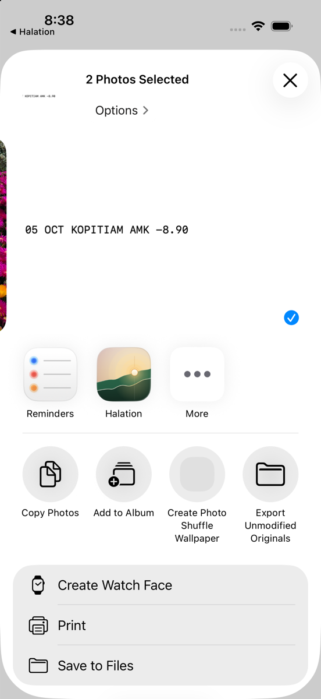
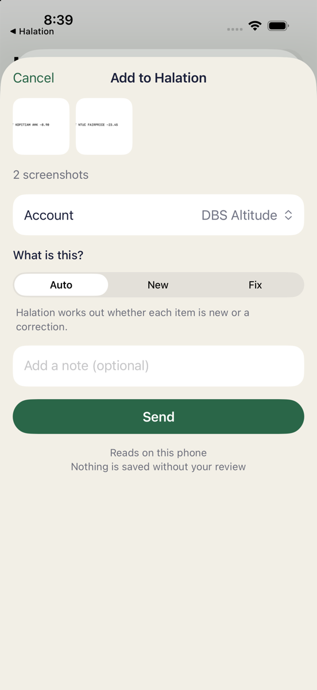
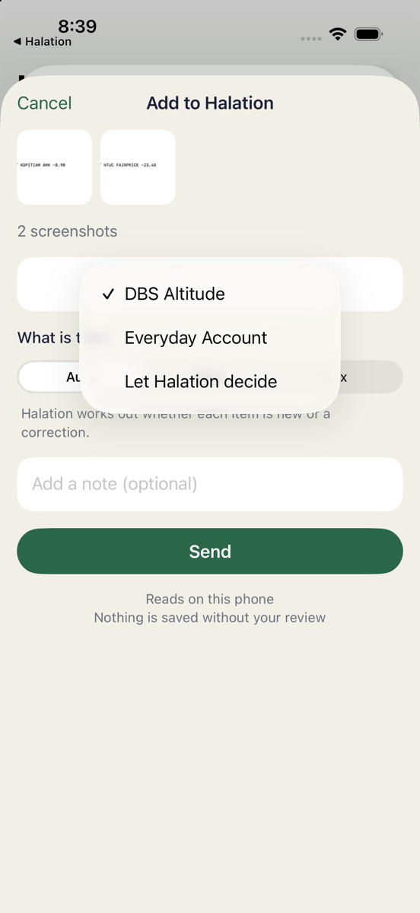
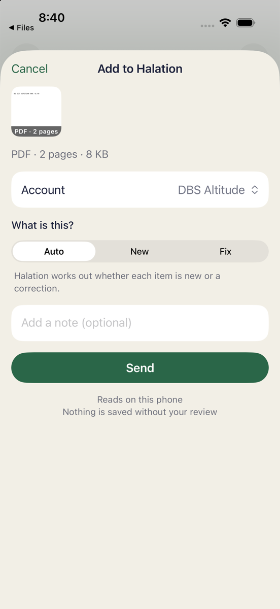

# PR 1 share-sheet evidence from the e6baed7 run

All captures in this directory came from the real Simulator run at **e6baed7e189567afeafcd67165393410a5304463**, on 2026-10-07 approximately 03:38–03:42 UTC. This is a later revision containing PR 1, **not a new E2E run of the PR 1 branch head receiving this evidence**. The `apps/ios/HowMuchShare` tree is unchanged between PR 1's tested `10a0ee2d91e751610ea06b96407ad407e158983d` and this revision (`git diff 10a0ee2 e6baed7 -- apps/ios/HowMuchShare` returned no differences). This claim is scoped to that extension source tree, not the entire app.

## Setup

- macOS 26.6.2; Xcode 27 RC; iPhone 17 / iOS 26.5 Simulator `EDD9B083-63F1-44E6-9A7B-0A6964CC2561`.
- App `sg.soon.howmuch`, isolated local/on-device backend, synthetic data only. No secrets, production access or remote API.
- Two open accounts: DBS Altitude (`e2e-dbs`) and Everyday Account. Closed account: Closed Synthetic Account. Last-used open account DBS.
- Exactly one existing approved ledger row: `e2e-existing-kopitiam`, date 2026-10-05, amount -8900 milliunits, payee Kopitiam, DBS.
- Old failed synthetic job directories were preserved outside active Jobs; active Inbox/Jobs were empty at the ready baseline.
- Photos contained synthetic PNGs with `05 OCT KOPITIAM AMK -8.90` and `05 OCT NTUC FAIRPRICE -23.45`. Files contained a synthetic two-page PDF with those lines on separate pages. No personal documents were used.

## Exact interactions and observations

| Action / expected result | Observed | Evidence | Result |
|---|---|---|---|
| Photos → Select two fixture PNGs → Share | Halation appears in native share row | 02-photos-native-share.png | Pass |
| Tap Halation | Add to Halation, two thumbnails, `2 screenshots` | 03-two-image-sheet.png | Pass |
| Open Account menu | DBS selected; DBS, Everyday and Let Halation decide present; closed account absent | 04-account-menu.png, JSON share context | Pass |
| Inspect sheet | Auto/New/Fix, Note, on-device/privacy and review footnote visible | 03-two-image-sheet.png | Pass |
| Type `e6baed7 Photos E2E`, Send | Keyboard capitalizes stored note to `E6baed7 Photos E2E`; Sent to Halation confirmation; return to Photos, no Halation foreground | 05-sent-to-halation-desktop.png, 06-returned-photos.png, 06-after-photos.json | Pass |
| Files → PDF → Share → Halation | `PDF · 2 pages · 8 KB` badge/caption; DBS/Auto | 07-pdf-two-pages-sheet.png | Pass |
| Type `e6baed7 PDF E2E`, Send | Stored `E6baed7 PDF E2E`; Sent confirmation and return to Preview | 08-pdf-sent-desktop.png, 08-after-pdf.json | Pass |
| Share PDF a third time → Cancel | No new item: before/after Inbox, Jobs and transactions identical | 09-third-share-before-cancel.png, 08-after-pdf.json vs 10-after-cancel.json | Pass |
| Sending/cancelling must not write ledger | Still exactly the original approved Kopitiam row | All included snapshots | Pass |

The extension-dismissal/no-foreground observations were also recorded during the run; videos are retained locally but deliberately excluded from this commit.

## Manifest and cancellation evidence

- After Photos: one Inbox manifest, ID `3B36B4FE-8759-400D-82B0-C4C8E4DE3CD6`, two `image` sources (`image-1.PNG`, `image-2.PNG`), account `e2e-dbs`, `hint: auto`, `decideAccount: false`, note `E6baed7 Photos E2E`.
- After PDF: an additional manifest, ID `96D94F82-AE3F-41FF-BB85-785DEA4C9000`, one `pdf` source (`document-1.pdf`, 7805 bytes), same account/hint, note `E6baed7 PDF E2E`.
- After Cancel: still those same two manifests, no active Jobs before app ingestion, same one transaction. Compare the `inbox`, `jobs`, and `transactions` fields of snapshots 08 and 10; capture timestamps differ, as expected.
- The supplied JSON files retain complete captured source/account/hint/note fields and hashes. They contain synthetic data, not a database dump.

## Exact commands and sequence

From repository root, using the supplied product built for the exact revision:

```sh
export DEVELOPER_DIR=/Applications/Xcode-27.0-RC.app/Contents/Developer
export PATH="$DEVELOPER_DIR/usr/bin:$PATH"
UDID=EDD9B083-63F1-44E6-9A7B-0A6964CC2561
git rev-parse HEAD
xcrun simctl install "$UDID" build/xcode/DerivedData-simulator/Build/Products/Debug-iphonesimulator/HowMuch.app
xcrun simctl launch "$UDID" sg.soon.howmuch
# Confirm local mode, synthetic baseline and last-used DBS; no pending Jobs/Inbox.
xcrun simctl launch "$UDID" com.apple.mobileslideshow
# Perform Photos sequence in the table, then capture state.
xcrun simctl launch "$UDID" com.apple.DocumentsApp
# Perform PDF Send and third-share Cancel sequence, capture state after each.
xcrun simctl io "$UDID" screenshot OUTPUT.png
```

Historical snapshot commands were `python3 .amp/in/artifacts/share-intake/e6baed7/snapshot.py LABEL`, with labels `01-ready-baseline`, `06-after-photos`, `08-after-pdf`, `10-after-cancel`. That uncommitted helper dynamically resolved the data and app-group containers via `xcrun simctl get_app_container`, read `Inbox/**/*.json`, `Jobs/**/job.json` and `Intake/share-context.json`, and opened the local SQLite file in `mode=ro`. Its exact ledger query was:

```sql
SELECT id, account_id, date, amount_milli, payee_name_snapshot, approved FROM transactions;
```

It also read `SELECT id, name, closed, balance_milli FROM accounts`. The JSON snapshots here are the original captured results; no live state was recomputed while preparing this commit.

## Scope and known downstream limitation

The PR 1 share-sheet assertions passed. At this historical revision the main app later produced fallback proposals, but Inbox navigation failed with duplicate/missing `IntakeRoute` destinations, blocking approval. That is not a share-sheet pass for the downstream review flow. [runtime-excerpts.log](runtime-excerpts.log) preserves those exact historical warnings for context. Later B evidence at 9f53b14 separately demonstrates the repaired navigation; it is not retroactively attributed to this run.

## Key screenshots

All committed PNG copies are downscaled without cropping to at most 1200px on the long edge. Original captures remain local.

| Photos share row | Two-image sheet |
|---|---|
|  |  |

| Account menu | PDF sheet |
|---|---|
|  |  |

Only this report, selected PNGs, synthetic JSON snapshots and runtime excerpts are included. No videos, databases, secrets, source changes, fixture binaries, scripts or full logs are committed.
