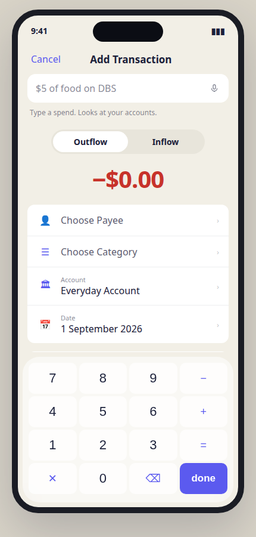
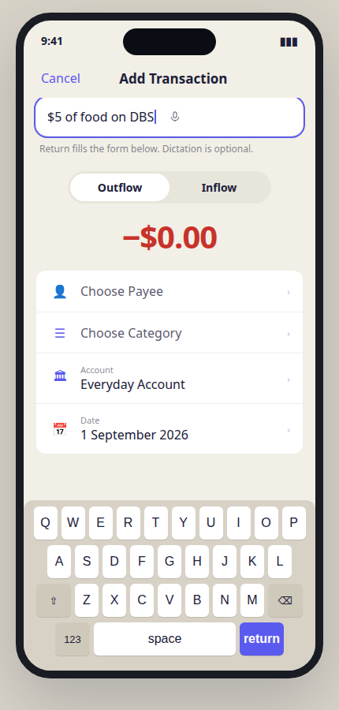
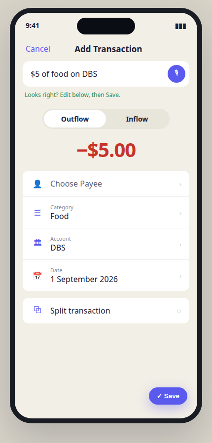
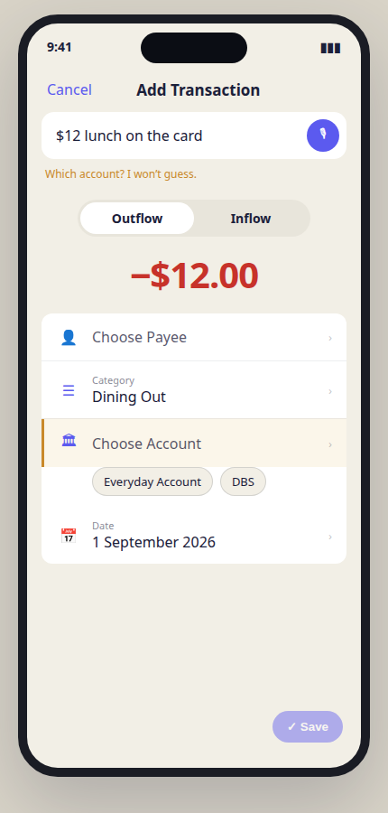
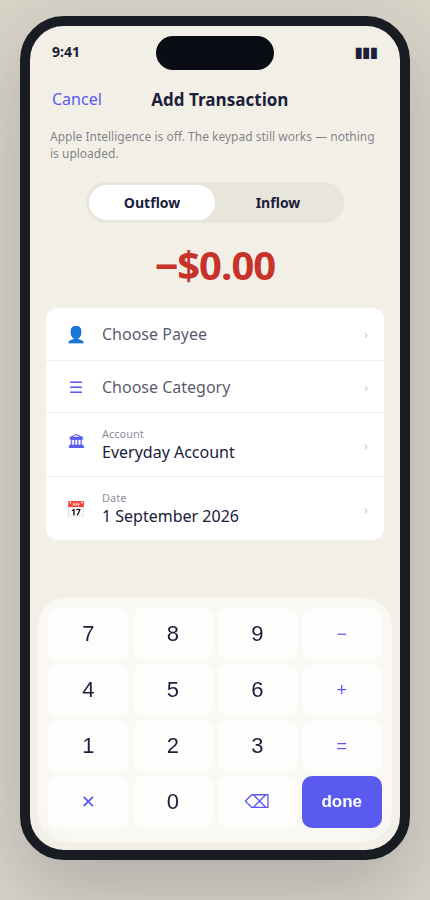
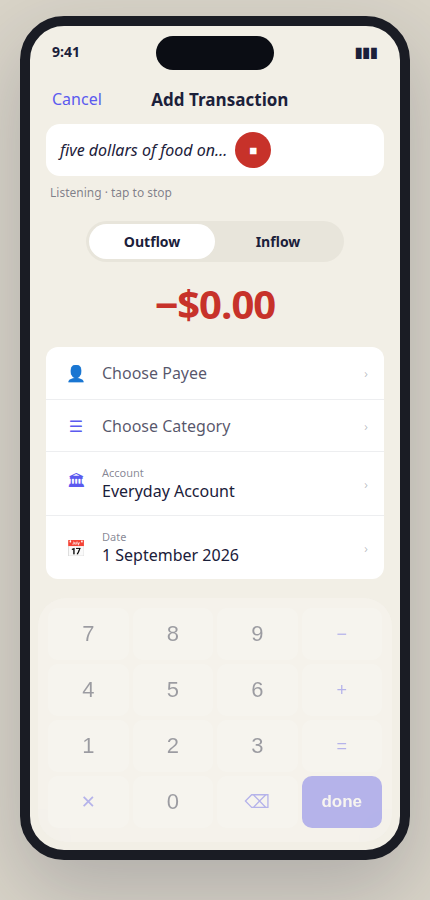
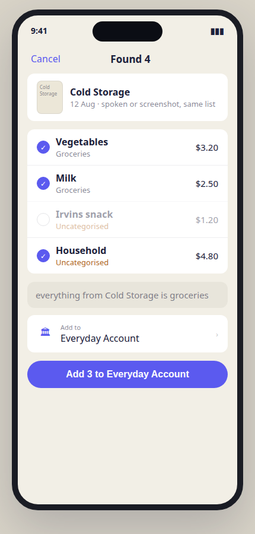
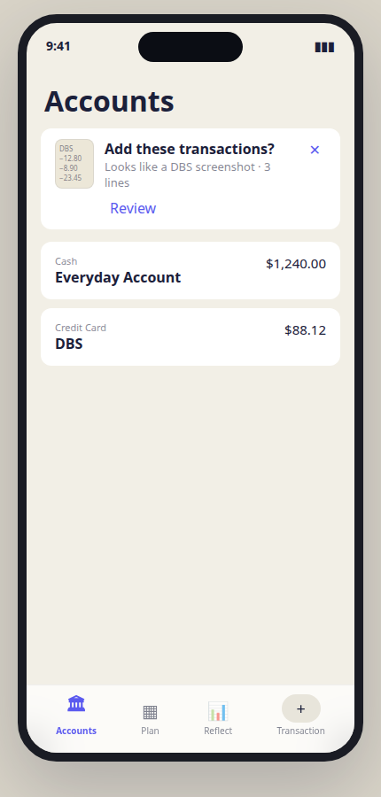
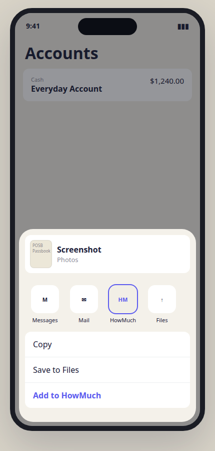

# Intake UI draft

Clickable prototype: [`intake-ui.html`](./intake-ui.html) (`?phone=1&screen=typing` for the daily path). This file is the layout spec; the HTML is the visual. Phone-frame PNGs live in [`intake-ui/`](./intake-ui/).

Filed against [#87](https://github.com/yjsoon/howmuch/issues/87). Do not treat this as shipped UI. No Swift changes in this slice.

**Type first.** The compose field is a text field on the existing sheet. You type a spend and hit Return. Paste works in the same box. System-keyboard dictation already types into that field — **no custom mic in v1.**

Placeholder is **data-driven** from `currencyFormat`, a real category, and the seeded account — e.g. `5 of Groceries on Everyday` — not a hardcoded `$5 of food on DBS`. No helper captions. The placeholder is the affordance; the filled form is the review.

### Daily path

| Idle | Typing (the common case) | Parsed `N == 1` |
| --- | --- | --- |
|  |  |  |

| Ambiguous | Apple Intelligence off |
| --- | --- |
|  |  |

### Optional dictate, many rows, later

| Dictate | Found N |
| --- | --- |
|  |  |

| Screenshot offer | Share sheet |
| --- | --- |
|  |  |

## Rule

Input is not confirmation. Typing, pasting, or saying a spend is intake. Looking at a `TransactionDraft` is review. A chat thread tries to be both.

Density follows **row count**, not source:

| Reader returns | Surface | Save control |
| --- | --- | --- |
| `N == 1` | Existing `AddTransactionSheet` / `TransactionFormView`, prefilled | Trailing glass **Save** (unchanged) |
| `N > 1` | New review list sheet | Full-width **Add {n} to {account}** |

Keyboard, paste, mic, share image, and later screenshot detection all hit the same reader. Structured Shortcuts skip the reader (they already are a draft) but still open through `presentCapture`. Spec: [`app-intents.md`](./app-intents.md), issue [#96](https://github.com/yjsoon/howmuch/issues/96).

## Tokens

Reuse `Theme` from `apps/ios/HowMuch/Support/Theme.swift`. Do not invent a second palette.

| Role | Light |
| --- | --- |
| Canvas | `#F2EFE6` |
| Card | white, 12pt continuous corners (`.ynabCard()`) |
| Muted (compose, keypad, repair) | `#E8E5DB` |
| Accent / Save | `#5B5AEF` |
| Mic (idle) | secondary ink, no fill |
| Ink | `#1B203A` |
| Amount header outflow | `#C7322A` |
| Register outflow amount | ink (not red) — `Theme.registerAmountColour` |
| Uncategorised | `#B0661C` |
| Ambiguous rail | same ochre/amber as uncategorised, 3pt leading inset |

Copy stays British (Uncategorised, colour). Currency follows the plan formatter, not a hardcoded `£`.

## Surfaces

### 1. Capture sheet — compose field (v1)

Today: `AddTransactionSheet` → `TransactionFormView`. Title **Add Transaction**. Leading **Cancel**. Amount header (Outflow/Inflow + 40pt monospaced amount). Detail card (Payee, Category, Account, Date). Split card. Extras. Glass keypad while amount is 0. Trailing glass **Save** when the keypad is down. `canSave` is amount + account; payee is optional.

**Add one text field above the amount header, gated `!isEditing`:**

- White 48pt `TextField` in a `ynabCard`.
- Placeholder built from plan currency, a real category, and the seeded account.
- **No custom mic** in v1 (system keyboard dictation is enough).
- **No caption** under the field.

Two focus modes that must not fight. Exactly one of {QWERTY, glass keypad}:

| You tap | Keyboard | Amount keypad | Trailing Save |
| --- | --- | --- | --- |
| Amount | hidden (compose resigns first) | shown | hidden (today) |
| Compose | system QWERTY | hidden | **hidden** (Return is the primary) |

If parse yields no amount, show the keypad with primary `done`, as today. After a successful parse with amount > 0, collapse the keypad the same way Duplicate does.

Return / go on the text keyboard runs the reader. Do not parse on every keystroke. Paste into the field is the same path as typing.

That field is a command line. No reply bubble. The form below is the reply.

Keep the amount keypad for the existing capture path. Do **not** retitle the sheet “Add expense”. Do **not** replace **Save** with `Save $5.00`. The keypad primary key stays `done` / `next` / `save`. Foundation Models `.unavailable(.modelNotReady)` is “downloading”, not off — do not hide compose for that.

### 2. Typing (the common case)

Caret in the field. System keyboard. Amount and pickers stay put until Return. Trailing Save is hidden while compose is focused.

### 3. Optional: listening (after typed parse ships)

Do not ship a custom mic in v1. If system dictation is inadequate later, a stop-state on the same field is allowed. Not a Siri sheet.

### 4. Parsed (`N == 1`)

Compose keeps the sentence. No “Looks right?” caption. Amount, direction, category, and account bind onto the existing `TransactionDraft` / `DisclosureValueRow`s. Unresolved fields stay placeholders. **Save** enables when `canSave` is true.

### 5. Ambiguous

The model never silent-picks an account or category.

- No first-person copy. Footnote **Which account?** or **Which category?** in `Theme.uncategorised` (ochre). Do not invent amber; red stays `Theme.outflow` errors.
- The matching `DisclosureValueRow` stays on its placeholder.
- If two or three live matches, tappable capsules on one indented row under that disclosure (56pt `CardDivider` indent). Same muted/accent capsule language as `FilterChip`, **without** the chevron (that glyph means a menu). Chips vanish on selection.
- **Save** stays disabled until the user taps a chip or the picker.

Nickname resolution (“card x”) is a data problem, not a second UI. Wrong silent match is worse than an empty picker.

### 6. Apple Intelligence off

Hide the compose field with no residual gap. Layout identical to today’s sheet. Fail closed. No Worker fallback. Do not hide compose merely because the model is still downloading.

### 7. Reading (inbox / share)

Same canvas. Title **Reading…**. Thumbnail + `Stays on this device`. No transcript. This sheet becomes **N Transactions** or the capture form.

### 8. Review list (`N > 1`)

New sheet. Title **{N} Transactions** (noun, like “Add Transaction”). Leading **Cancel**. Two typed spends in one sentence are enough — screenshots are not required.

1. Source strip: thumbnail, or `Typed · just now`.
2. Register chrome **minus** the trailing status control (that circle already means approve/cleared). Leading include control; all included by default. Payee semibold, category footnote (ochre if Uncategorised), tabular amount in **register** colour (ink for outflows). Unchecked rows dim and drop on commit. Tap a row → `TransactionFormView` for that draft (keypad hidden if amount > 0).
3. Repair line: muted **text** field, footnote density, not a banner. Placeholder `everything from Cold Storage is groceries`. Mutates the list. Type-then-Return, no send arrow.
4. One **Add to** account picker for rows without an unambiguous account.
5. Trailing glass prominent control (same family as Save): `Add {n} to {account}`. Live `n`. Disabled at zero included or while any included row is unsaveable. No 40pt amount header on this sheet.

### 9. Share sheet (later)

System share sheet. HowMuch in the app row (`public.image`, `public.text`). Extension copies bytes into App Group `group.sg.soon.howmuch` and completes. No Foundation Models in the extension. No custom review UI there. Main app claims `Inbox/` → `Reading/` and applies the density rule.

### 10. Screenshot offer (later, default off)

Accounts tab, same card language as `OutboxCard`. Headline `Add these transactions?` Caption `Looks like a screenshot · {n} lines`. Trailing **Review** + dismiss. Review is the density rule, not a new parser.

## Shared capture door (Shortcuts + intake)

Tab +, Quick Action, Duplicate, compose, share, and App Intents must not each own a sheet. One identifiable `CaptureRequest` presented with `.sheet(item:)`, handed off through `CaptureRouter.shared`, consumed only when no other sheet is up. Spec: [`app-intents.md`](./app-intents.md).

## Mapping onto existing types

| UI bit | Code |
| --- | --- |
| Compose `TextField` | New view in `TransactionFormView`, above `amountHeader`, `!isEditing` |
| Focus compose | Hide amount keypad **and** trailing Save; system keyboard |
| Ambiguous chips | Muted/accent capsules (FilterChip language, no chevron) + `Theme.uncategorised` footnote |
| Prefill | `TransactionFormView(draft:)` already exists (Duplicate for Today) |
| Save one | `AppModel.commit(_:)` |
| Save many | `commit([drafts])` + one outbox save; not `/transactions/import` |
| List rows | `TransactionRow` layout, include control instead of cleared status |
| Account/category chips | Same IDs the pickers already use |
| Offer banner | Sibling of `OutboxCard` on `AccountsView` |

## Explicit non-UI

- Chat thread, typing indicator, “HowMuch: I found four spends”.
- Voice-assistant orb, custom mic in v1, sparkles, Apple Intelligence badge chrome.
- Helper captions (“Type a spend”, “I won’t guess”).
- Photos permission in v1.
- Web paste / web OCR.
- Model-invented splits. Open the real editor.

## Build order (UI only)

1. Compose **text field** + stub parse on Return → prefill → existing Save. Prove typing a spend fills amount, category, account. No custom mic.
2. Paste into the same field.
3. Real on-device text reader; ochre empty fields + `FilterChip`s.
4. `N > 1` list from two spends in one typed sentence.
5. Optional custom mic only if system dictation is inadequate.
6. Share extension (no extra confirmation chrome).
7. Repair line (typed).
8. Later: screenshot offer.
