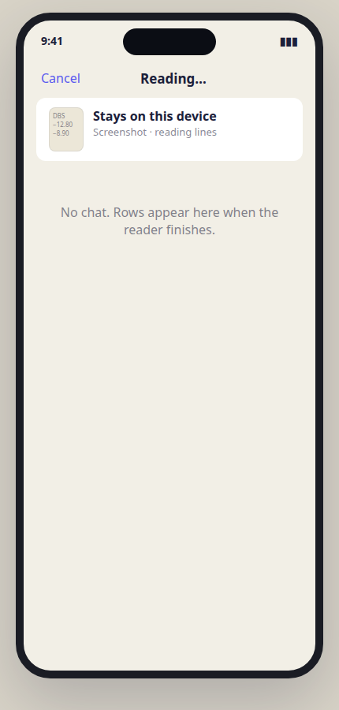

# Intake UI draft

Clickable prototype: [`intake-ui.html`](./intake-ui.html) (`?phone=1&screen=parsed` for a single frame). This file is the layout spec; the HTML is the visual. Phone-frame PNGs live in [`intake-ui/`](./intake-ui/).

Filed against [#87](https://github.com/yjsoon/howmuch/issues/87). Do not treat this as shipped UI. No Swift changes in this slice.

### Daily path

| Idle | Listening | Parsed `N == 1` |
| --- | --- | --- |
|  |  |  |

| Ambiguous | Apple Intelligence off |
| --- | --- |
|  |  |

### Many rows and later

| Reading | Found N |
| --- | --- |
|  |  |

| Screenshot offer | Share sheet |
| --- | --- |
|  |  |

## Rule

Input is not confirmation. Saying or pasting a spend is intake. Looking at a `TransactionDraft` is review. A chat thread tries to be both.

Density follows **row count**, not source:

| Reader returns | Surface | Save control |
| --- | --- | --- |
| `N == 1` | Existing `AddTransactionSheet` / `TransactionFormView`, prefilled | Trailing glass **Save** (unchanged) |
| `N > 1` | New review list sheet | Full-width **Add {n} to {account}** |

Mic, keyboard, paste, share image, and later screenshot detection all hit the same reader. Source never picks a third chrome.

## Tokens

Reuse `Theme` from `apps/ios/HowMuch/Support/Theme.swift`. Do not invent a second palette.

| Role | Light |
| --- | --- |
| Canvas | `#F2EFE6` |
| Card | white, 12pt continuous corners (`.ynabCard()`) |
| Muted (compose, keypad, repair) | `#E8E5DB` |
| Accent / Save / mic | `#5B5AEF` |
| Ink | `#1B203A` |
| Amount header outflow | `#C7322A` |
| Register outflow amount | ink (not red) — `Theme.registerAmountColour` |
| Uncategorised | `#B0661C` |
| Ambiguous rail | same ochre/amber as uncategorised, 3pt leading inset |

Copy stays British (Uncategorised, colour). Currency follows the plan formatter, not a hardcoded `£`.

## Surfaces

### 1. Capture sheet — compose field (v1)

Today: `AddTransactionSheet` → `TransactionFormView`. Title **Add Transaction**. Leading **Cancel**. Amount header (Outflow/Inflow + 40pt monospaced amount). Detail card (Payee, Category, Account, Date). Split card. Extras. Glass keypad while amount is 0. Trailing glass **Save** when the keypad is down. `canSave` is amount + account; payee is optional.

**Add one row above the amount header:**

- White (or muted) 48pt field.
- Placeholder `$5 of food on DBS`.
- Trailing 36pt accent mic.
- 12pt caption: `Speak or type a spend. Looks at your accounts.`

That field is a command line. No reply bubble. The form below is the reply.

Keep the keypad. Fresh capture still opens it. Duplicate-for-Today still skips it when amount is already set. After a successful parse with amount > 0, collapse the keypad the same way Duplicate does.

Do **not** retitle the sheet “Add expense”. Do **not** replace **Save** with `Save $5.00`. The keypad primary key stays `done` / `next` / `save` as it is now.

### 2. Listening

Mic fill becomes outflow red, icon becomes stop. Field shows the live transcript in italic. Caption: `Listening · tap to stop`. Amount and pickers do not move until stop (or a short pause after the last token). Keypad may dim; it must not disappear into a voice-assistant orb.

### 3. Parsed (`N == 1`)

Compose keeps the utterance. Caption: `Looks right? Edit below, then Save.` Amount, direction, category, and account bind onto the existing `TransactionDraft` / `DisclosureValueRow`s. Unresolved fields stay placeholders. **Save** enables when `canSave` is true.

### 4. Ambiguous

The model never silent-picks an account or category.

- Compose caption in amber: `Which account? I won’t guess.` (or category, if that is the miss).
- The matching `DisclosureValueRow` stays on its placeholder.
- If two or three live accounts/categories match, wrap chips **inside the same detail card**, under that row, with an amber leading rail on the row.
- **Save** stays disabled until the user taps a chip or the picker.

Nickname resolution (“card x”) is a data problem, not a second UI. Wrong silent match is worse than an empty picker.

### 5. Apple Intelligence off

Hide the compose field. One caption: `Apple Intelligence is off. The keypad still works — nothing is uploaded.` Fail closed. No Worker fallback.

### 6. Reading (inbox / share)

New sheet, same canvas. Title **Reading…**. Thumbnail + `Stays on this device`. No transcript. This is the same sheet that becomes Found N or the capture form.

### 7. Review list (`N > 1`)

New sheet. Title **Found {N}**. Leading **Cancel**.

1. Source strip: thumbnail or mic glyph, payee/date or `Spoken · just now`.
2. White card of register rows: include circle, payee, category footnote (ochre if Uncategorised), tabular amount in **register** colour (ink for outflows). Unchecked rows dim and are dropped on commit. Tap a row → `TransactionFormView` for that draft.
3. Repair line (muted field). Placeholder `everything from Cold Storage is groceries`. Mutates the list. No send arrow, no thread.
4. One **Add to** account picker (applies to rows that do not already have an unambiguous account).
5. Full-width accent pill: `Add {includedCount} to {account}`.

Two spends in one sentence is enough to prove this before any image work.

### 8. Share sheet (later)

System share sheet. HowMuch in the app row (`public.image`, `public.text`). Extension copies bytes into App Group `group.sg.soon.howmuch` and completes. No Foundation Models in the extension. No custom review UI there. Main app claims `Inbox/` → `Reading/` and applies the density rule.

### 9. Screenshot offer (later, default off)

Accounts tab, same card language as `OutboxCard`. Headline `Add these transactions?` Caption `Looks like a screenshot · {n} lines`. Trailing **Review** + dismiss. Review is the density rule, not a new parser.

## Mapping onto existing types

| UI bit | Code |
| --- | --- |
| Compose + mic | New view in `TransactionFormView`, above `amountHeader` |
| Prefill | `TransactionFormView(draft:)` already exists (Duplicate for Today) |
| Save one | `AppModel.commit(_:)` |
| Save many | `commit([drafts])` + one outbox save; not `/transactions/import` |
| List rows | `TransactionRow` layout, include control instead of cleared status |
| Account/category chips | Same IDs the pickers already use |
| Offer banner | Sibling of `OutboxCard` on `AccountsView` |

## Explicit non-UI

- Chat thread, typing indicator, “HowMuch: I found four spends”.
- Sparkles / Apple Intelligence badge chrome.
- Photos permission in v1.
- Web paste / web OCR.
- Model-invented splits. Open the real editor.

## Build order (UI only)

1. Compose + stub parse → prefill → existing Save.
2. Real on-device text reader; amber empty fields.
3. SpeechAnalyzer into the same field.
4. `N > 1` list (two spends in one sentence).
5. Share extension (no extra confirmation chrome).
6. Repair line.
7. Later: screenshot offer.
