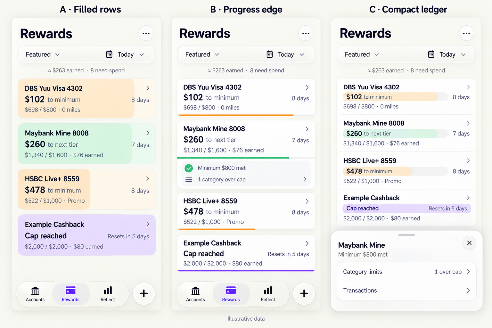

# iOS Rewards: filled-row design handoff

Status: the owner selected **A — Filled rows**. This PR records the design for a
subsequent implementation; it does not implement or validate the UI. Do not
reinterpret it as the rejected large-summary dashboard, progress-edge cards, or
compact ledger alternative. No merge or build publication is authorized here.

## Outcome

Make Rewards a compact spending-decision board: **which card, how much more,
and by when?** Preserve the web Rewards Tracker's useful information hierarchy
while using native iOS controls. The previous detailed card proposal remains a
source of secondary information, not the default layout.

The whole rounded row is a progress track with a soft leading-to-trailing fill.
Do not stack a separate progress rail, percentage badge, repeated status label,
and large totals card above the same information.

## Selected layout



**Implement A, the left panel.** B and C are comparison alternatives, not additional
screens to build. This owner-approved graphic is a generated design reference,
not an app screenshot or validation evidence. It omits the collapsed exception
warning required below; keep that warning visible in the implementation.

This wireframe uses synthetic data. The pale fill in the first example occupies
60% of the entire row behind all three lines, not just the amount line.

```text
Rewards                                          (…)
       [ Featured ▾                 Today ▾ ]
              ≈ $120 earned · 3 need spend

┌──────────────────────────────────────────────────┐
│ Everyday Card                                  › │
│ $200 to minimum                      8 days left │
│ $300 / $500 · $0 earned                           │
└──────────────────────────────────────────────────┘
┌──────────────────────────────────────────────────┐
│ Travel Card                                    › │
│ $350 to next tier                    5 days left │
│ $650 / $1,000 · 1,300 miles                        │
│ ! 1 category over cap                            │
└──────────────────────────────────────────────────┘
       [ Accounts    Rewards    Reflect ]      (+)
```

- Use three text lines for an ordinary collapsed row: name, dominant action
  with deadline, then spend/target and earned cashback or miles. Allow extra
  space for exceptional warnings and accessibility text sizes; no fixed height
  that clips content. Start around 100–110 points at default text size.
- Use quiet amber for an unmet minimum, mint for earning/next-tier progress,
  and a subdued completed treatment for a terminal cap. Text conveys meaning
  without color. Keep fill contrast low enough for text across the fill boundary.
- Apply system Liquid Glass to floating navigation/control surfaces, not as a
  translucent background behind financial text. Keep the existing global tabs
  and transaction +; the + does not become Add reward card. Prefer native system
  materials and controls, not custom blur/lensing approximations.
- Keep Featured and Today as compact menu controls in one row. Remove the
  competing segmented controls, as-of enabling switch, grouping/account chips,
  inline valuation editor, and display-preference explanation from the main board.
- Show a quiet earned-value summary and concise labeled status counts. Omit
  zero counts; retain access to all statuses, including failed qualification and
  terminal cap. Do not hide an important status just to fit a single line.
- Default to Featured, with All cards available. Preserve saved ordering; use
  nearest deadline as the fallback for cards without a saved position. Grouping
  by cashback/miles remains optional rather than a mandatory interruption.

## Progress and financial contracts

Read [the existing rewards semantics](../rewards.md) before implementing a view
projection. Use the existing calculation results; do not change reward math to
match an illustration or import a second calculator.

- The dominant action distinguishes next-tier distance, unmet minimum, remaining
  terminal-cap headroom, cap reached/exceeded, and no configured target. Preserve
  the web reference's tier/minimum priorities while exposing any unmet or failed
  qualification that would make a next-tier label misleading.
- The fill represents progress toward the **displayed target**. The spend and
  denominator on the third line must use that same basis. Clamp the visual fill
  to 0–100%; retain truthful over-cap amounts in text. An unlimited card has no
  fabricated denominator or full/completed fill.
- A full row means that target was reached, not automatically “stop spending.”
  An intermediate tier cap is different from a terminal cap. On reaching a tier,
  advance to the next applicable target using the existing calculation semantics.
- Minimum qualification may use raw qualifying spend while a block-rounded cap
  uses counted spend. Monthly qualification within an anchored multi-month period
  must not compare whole-period spend against a single monthly minimum.
- Dates are card-specific and evaluated as of the selected date in Asia/Singapore.
  Inspect exact period/reset boundaries; do not derive days left from an unrelated
  calendar month or the device's current date during historical inspection.
- Featured, hidden and ordering choices affect presentation, not report totals.
  Account scope changes the report. Keep the summary's scope explicit when cards
  are filtered/hidden; status counts must also have a clear, consistent scope.

## Secondary information and controls

- Tap a row to inspect details, not immediately enter a configuration form.
  Use a native disclosure or detail presentation for categories, qualification
  months, period dates, rates, tiers and transactions. Reuse existing detail and
  editor capabilities where practical; editing stays available as a named action.
- Always expose exceptions on the collapsed row: category over cap, failed
  qualification, and other calculation states that change the spending decision.
  Put category limits and minimum-met context in the expanded/detail content.
- Category mix widths and category cap percentages are different quantities in
  the web app. If retaining a mix strip in details, label it; show category cap
  usage on individually labeled rows, not ambiguous percentages in the mix strip.
- Today opens native as-of date selection with a clear return to Today. Preserve
  historical range reports separately, including month/preset/custom selection.
  Do not present a multi-period aggregate as one current-period progress row.
- More contains Add card, customization/reordering, account scope, miles valuation,
  import/export and access to historical reports as appropriate. Avoid a deeply
  nested menu. Active account/date restrictions remain visible on the board.
- Use pull to refresh. Move drag handles into explicit reorder/edit mode. Preserve
  hidden-card restoration and existing plan-local display preferences.
- Distinguish confirmed no configured cards (Add card / Import rewards) from no
  matches in the selected report and from all cards hidden. Preserve controls and
  offer the appropriate reset/reveal action in the latter states.
- Preserve current persistent hiding in this redesign. The web's temporary
  “Hide until next cycle” requires separate lifecycle behavior; do not relabel
  persistent hiding as temporary or silently implement it as a cosmetic change.

## Implementation starting points

- `apps/ios/HowMuch/Views/RewardsView.swift`: board, filters, totals, display
  preferences and `RewardTile`; primary owner of this change.
- `apps/ios/HowMuch/Views/ReflectDetails.swift`: reusable date/account controls.
- `apps/ios/HowMuch/Views/RewardCardEditorView.swift`: existing editing and ledger
  capabilities; keep configuration accessible without duplicating the editor.
- `apps/ios/HowMuch/Models/APIModels.swift`: report/calculation fields.
- `apps/ios/HowMuchTests/RewardsReportTests.swift`: existing report coverage.
- [Rewards Tracker web](https://github.com/yjsoon/ynab-rewards-tracker): inspect
  `apps/web/components/CardSummaryCompact.tsx`,
  `apps/web/components/dashboard/DashboardStatusSummary.tsx`,
  `apps/web/components/SubcategoryBreakdownCompact.tsx`, and
  `packages/app-core/src/rewards-engine/dashboard-projection.ts` for intent.
  The pinned source in `docs/rewards.md` remains the calculation compatibility
  reference; do not substitute the Expo client's divergent behavior.
- Apple HIG: [menus](https://developer.apple.com/design/human-interface-guidelines/menus),
  [toolbars](https://developer.apple.com/design/human-interface-guidelines/toolbars),
  and [accessibility](https://developer.apple.com/design/human-interface-guidelines/accessibility).

This is an iOS presentation change, not a web redesign, calculator rewrite,
database migration, or publication task. If required data is missing, identify
the exact contract gap before expanding beyond the view/model boundary.

## Acceptance and evidence for the implementation agent

- [ ] Default screen uses whole-row fills and compact text, without a separate
  progress rail or large summary card. Secondary content is discoverable.
- [ ] Projection tests distinguish below/exactly-at/above minimum, next-tier
  transition, intermediate versus final cap, unlimited/zero target, refunds,
  block rounding and failed monthly qualification. Expected values are derived
  independently, not read back from the projection under test.
- [ ] Date tests cover a billing-day boundary, short month, anchored qualification
  window, historical as-of date, and a non-Singapore device timezone.
- [ ] Render and inspect ordinary rows, near/final cap, category warning, failed
  qualification, expanded details, historical mode and each empty-state cause.
- [ ] Verify native menu/date interactions, refresh, row details, editor access,
  filtering, hiding/restoring, reordering and valuation without changing totals
  through display-only choices. Confirm plan switching does not leak preferences.
- [ ] Inspect small iPhone widths, large Dynamic Type, light/dark appearance,
  Increase Contrast and Reduce Transparency. Supply meaningful VoiceOver values
  for target/progress/deadline and 44-point interactive targets. Respect Reduce
  Motion if animating fills; urgency and failures cannot depend on color alone.
- [ ] Follow `apps/ios/AGENTS.md` and `scripts/ios-xcodebuild.sh` on an available
  Mac. Run relevant tests and inspect actual native screenshots. Linux/browser
  mockups are not Xcode or native-rendering evidence.
- [ ] Report executed commands, results and inspected representative screenshots
  with synthetic data. Record limitations honestly. No Speedflight, signing,
  deployment or merge without the corresponding authorization.

The owner explicitly authorized publishing the concept graphic above. That does
not authorize publishing the original financial screenshots or unrelated private
data. The selected A panel and requirements above define the handoff; use synthetic
data for subsequent implementation evidence.
